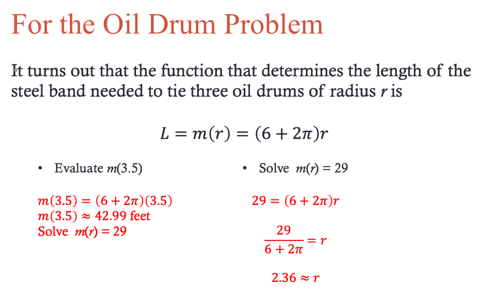
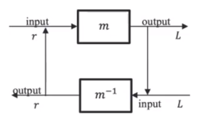
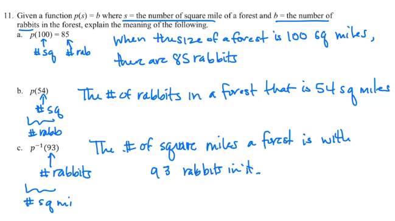
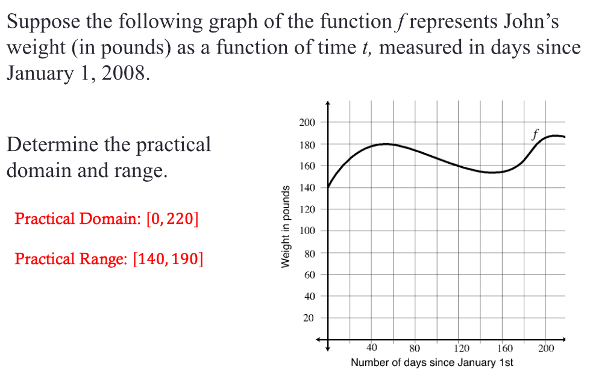
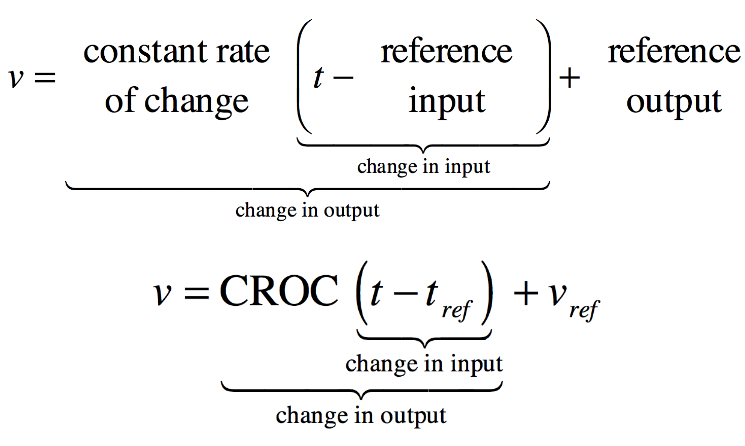

# Unit 1 Notes

# Table of Contents

- [Module 2](#module-2)
  - [General Notes](#general-notes)
  - [Functions](#functions)
    - [Function Language](#function-language)
    - [Example 1](#example-1)
    - [Example 2](#example-2)
    - [Example 3 - Oil Drum Problem](#example-3---oil-drum-problem)
  - [Inverse Functions](#inverse-functions)
    - [Finding The Inverse](#finding-the-inverse)
    - [Inverse of a Graph Example](#inverse-of-a-graph-example)
  - [Writing Out Functions](#writing-out-functions)
  - [Domain and Range](#domain-and-range)
    - [Example 1](#example-1-1)
    - [Example 2](#example-2-1)
    - [Example 3](#example-3)
  - [Intercepts](#intercepts)
    - [Vertical Intercepts](#vertical-intercepts)
    - [Horizontal Intercepts](#horizontal-intercepts)
  - [Constant Rate of Change](#constant-rate-of-change)
    - [Example 1](#example-1-2)
- [Module 3](#module-3)
  - [General Notes](#general-notes-1)
  - [Constant Rate of Change (Continued)](#constant-rate-of-change-continued)
    - [Change in Output Value](#change-in-output-value)
    - [Change in Input Value](#change-in-input-value)
    - [Change In Output](#change-in-output)
  - [General Form of a Linear Function](#general-form-of-a-linear-function)
- [Module 4](#module-4)
  - [General Notes](#general-notes-2)
  - [Average Rate of Change](#average-rate-of-change)
    - [Example](#example)
    - [Polynomial Example](#polynomial-example)
  - [Linear Regression](#linear-regression)
    - [Coefficient of Determination](#coefficient-of-determination)

# Module 2 - Function Review, Function Notation, Inverse Functions

The Google Slides can be
found [Here](https://docs.google.com/presentation/d/e/2PACX-1vRfTdak79YenGY3YC0UNRa1j6N7MTNX8HQNgC1czcfaWhCsbMbWEV6WXKL8-J_NDZPgU4nZeauusE1t/embed?start=false&loop=false&delayms=3000&slide=id.p1)

## General Notes

- **Quantity:** A characteristic or attribute of some object you can imagine
  measuring.
    - When defining or identifying a quantity, we must be specific about what
      object, and what specific characteristic about that object, we're
      referring
      to.
- **Variable:** A character or symbol used to represent a quantity.
- **Evaluate:** To find the output of a function corresponding to a given input.
- **Solving:** To find the input of a function corresponding to a given output
- **Domain:** the set of all reasonable inputs values of a function.
- **Range:** The set of all corresponding output values of a function
- **Interval Notation:** [0, 100]
- **Inequality:** 0 <= x <= 100

## Functions

### Function Language

We say "_output_ as a function of _input_" or "_output_ in terms of _input_"

- y as a function of x **or** y in terms of x
- _E.g. Length of the steel band with respect to the radius of the oil drums_

If an input points to more than one output, then it is **not** a function.

### Example 1

### Example 2

### Example 3 - Oil Drum Problem

- `L` is the output
- `r` is the input

## Inverse Functions

An inverse function is a function that undoes the operations of an original
function.

- This function inverses the oil drum problem's function.
- The `m` is the inverse, not a negative exponent
- This image shows that `L` is a function of `r` (the name of the function is
  `m`) and that `r` is a function of `L` (specifically, the function is the
  inverse of function `m` and is written **m-1**).
- **y = f(x) means that x = f-1(y) if the inverse of f is a function.**
- The inverse of a function is not always a function.
    - _A function has one input and one output_

- `F` is the output
- `c` is the input

- Always write the notation indicating that the input and outputs have switched.

### Finding The Inverse

1. Write the formula without the notation:
    1. **c = j(b) = 5b + 12**
    2. **c = 5b + 12**
2. Isolate the input until it's by itself

### Inverse of a Graph Example

<

### Example problem

- _Remember not to use linear regression when creating the linear formula,
  instead use the **point-slope form: y - b = m(x - a)**_

A devastating freeze in California’s Central Valley in January 2007 wiped out
approximately 75% of the state’s citrus crop. It turns out that the cost for a
box of oranges is a function of the percentage of the citrus crop that was
frozen, i.e. **c = g(P)**, where **c** is the price of a box of oranges and
**P** is the percentage of the citrus crop that was frozen. When only 20% of the
crop was frozen, the price for a box of oranges was $11.58. However, the price
per box was $25.32 when 80% of the crop was frozen.

#### Finding The Linear Function

1. Identify the two given points: **(20, 11.58)** and **(80, 25.32)**
2. Calculate the slope **(m)** using the formula: **m = (y2 - y1) / (x2 - x1)**,
   where **(x1, y1) = (20, 11.58)** and **(x2, y2) = (80, 25.32)**
3. Plug in the values into the formula to get: **m = (25.32 - 11.58) / (80 - 20)
   = (13.74) / (60) = 0.229**
4. Use the point-slope form of a linear equation to find the equation of the
   line: **y - y1 = m (x - x1)**, where **(x1, y1) = (20, 11.58)**
5. Plug in the values into the formula to get: **y - 11.58 = 0.229 (x - 20)**
6. Rearrange the equation to the standard form: **y = 0.229x + b**, where **b**
   is the y-intercept
7. Calculate the y-intercept using the formula: **b = y1 - m * x1**, where
   **(x1, y1) = (20, 11.58)**
8. Plug in the values into the formula to get: **b = 11.58 - (0.229 * 20) =
   11.58 \- 4.58 = 7**
9. The equation of the line is: **y = 0.229x + 7**, which represents the cost of
   a box of oranges as a function of the percentage of the citrus crop that was
   frozen.

#### Finding The Inverse Function

1. Write the original function in the form **y = f(x): c = 0.229P + 7**
2. Replace **y** with **x** and **x** with **y**: **x = 0.229P + 7**
3. Solve for **P: x - 7 = 0.229P**, then **P = (x - 7) / 0.229**
4. The inverse function is: **P = (c - 7) / 0.229**

**Summary:**

1. To find the inverse of a function, switch the roles of **x** and **y**.
2. Write the original function in the form **y = f(x)**.
3. Replace **y** with **x** and **x** with **y**.
4. Solve for the original variable (in this case, P).
5. The inverse function is the result from step 4.

_Note: The inverse of a function is not always a function. The inverse of a
function is a function only if the original function is a one-to-one function._

## Writing Out Functions

## Domain and Range

- **Domain:** the set of all reasonable inputs values of a function.
- **Range:** The set of all corresponding output values of a function

### Example 1

### Example 2

### Example 3

## Intercepts

### Vertical Intercepts

The **Vertical Intercept** of a function is the coordinate point where the graph
of the function crosses the vertical axis.

- This point will always be in the form **(0, b)**
- The vertical intercept can be found graphically by determining the point where
  teh graph crosses the vertical axis.
- The vertical intercept can be found in a table or algebraically by first
  determining the value of **b**.
    - To do this, find the output of the function for an input of 0
      _(or **f(0) = b**)_. You then write the intercept in the form **(0, b)**.

### Horizontal Intercepts

The **Horizontal Intercept** of a function is the coordinate point where the
graph of the function crosses the horizontal axis.

- The point will always be in the form **(a, 0)**.
- The horizontal intercept can be found graphically by determining the point
  where the graph crosses the horizontal axis.
- The horizontal intercept can be found in a table or algebraically by first
  determining the value of **a**.
    - To do this, find the input of the function for an output of 0
      _(or solve for **a** when **f(a) = 0**)_. You then write the intercept in
      the form **(a, 0)**.

## Constant Rate of Change

It is said that two quantities are related by a **constant rate of change (CROC)
**
if the _ratio of the changes in quantities_ is <u>always</u> the same.

- Find the changes between each value in a table for all relevant columns, and
  use those in this formula.

### Example 1

- The triangle just means change

To figure out if the ratio is the same, the changes should all equal the same
number when put into the formula:

- Because all the numbers equal the same, it is **constant**.

This would be written as: **_For every additional minute_ that the water is left
running, the _amount of water_ in the bathtub _increases_ by 1.75 gallons.**

---

# Module 3 - Constant Rate of Change and Linear Functions

The Google Slides can be
found [Here](https://docs.google.com/presentation/d/e/2PACX-1vRQZlIZ2sA2AG4r3AcRtlHJL4G_KHOqBBWZXkOfJbGEOpCWHhsg9yBZfZfAfkv_lmKRIGB0kkMrIS48/embed?start=false&loop=false&delayms=3000)

## General Notes

## Constant Rate of Change (Continued)

The <u>value</u> of the constant rate of change can always be determined by:

Knowing this info, you can also get the other values.

### Change in Output Value

### Change in Input Value

---

Instead of always using the formula to find the change in input / output or the
CROC, you can use repeated reasoning.

Imagine you have a pool with a hose in it filling it with water (it already has
some in it). The CROC is **18.2**, and after **63 minutes**, there's
**1382.6 gallons** inside. Instead of using formulas to find each value per
different minute, you could create a formula:

1. Find **t** _(change in input value)_
    - **t - 63 = t**
2. Find **v** _(change in output value)_
    1. **18.2(t) = v**
    2. **18.2(t - 63) = v**
3. Find **_v_** _(total volume)_
    1. **v + 1382.6 = _v_**
    2. **18.2(t - 63) + 1382.6 = _v_**

- **** means **Increment / Change**

The last one is the finished formula for a function that defines a relationship
between the volume of water in the pool and the amount of time the pool has been
filling. It can also be summarized as:

### Change In Output

> **v = CROC(t - reference input) + reference Output**\
> **v = CROC(t - tref) + vref**

## General Form of a Linear Function

Whenever two quantities are related by a CROC, it's a line on a graph.

- That's where the **Linear Function** comes from
- The process above can be used any time there's a CROC and a known reference
  point.

# Module 4 - Linear Functions, Average Rate of Change and Linear Regression

- [Google Slide Notes](https://docs.google.com/presentation/d/e/2PACX-1vRhuAl62YlZaAScnG25vY0S-vfRUNMaE-3lpEeZMmJNSDHuouf-8WPyZQxgZNRPhQN6Eh852i5o5MeX/embed?start=false&loop=false&delayms=3000&slide=id.p1)

## General Notes

<u>General form of a linear function:</u>

When the reference point is the vertical intercept, the formula simplifies:

1. **v = CROC(t - tref) + vref**
2. **v = CROC(t - 0) + output of VI**
3. <u>**v = CROC(t) + Output of VI**</u> or <u>**y = m(x) + b**</u>

- This formula is a _special case_ of a Linear Function and can only be used
  if the reference point is the vertical intercept.

## Average Rate of Change

When the rate is not constant, the rate is called the
**Average Rate of Change (AVROC)**.

- The average rate of change can be found between **any two points** by:
    1. finding the constant rate of change between those two points.
    2. Dividing the constant rate of change by the input.

### Example

| Number of weeks dieting | Brandon's weight in pounds |
|:-------------------------------:|:----------------------------------:|
|                0                |                196                 |
|                2                |                187                 |
|                7                |                190                 |
|               12                |                184                 |

- The average rate of change between week **0** and **7** is **-0.86**, but the
  rate does not go down constantly at this rate. Because of this, the average
  rate of change means in this scenario:

  > **IF** Brandon's weight had **changed by the same amount each week <u>
  between
  > week 0 and week 7</u>**, he <u>_would have_</u> lost 0.86 pounds each week.
- If you needed to write this about a graph:
  > **IF** the function changed at a constant rate of change between **x = 0** 
  > and **x = 7**, we would have a line between those two points and that line 
  > <u>_would have_</u> a constant rate of **-0.86** (as shown in {color} on 
  > the graph).
- It's also important to use the data that is most closely related to the point
  in time that you are trying to find _(in this case, it would be between week
  **7** and **12**, not **0** and **7**)_.

The average rate of change is a _hypothetical_ constant rate.

To find what the output would be at any specific non-given point, multiply the
average rate of change by the change in input:

- **output = AROC(Input)**
    - The same as
      **output = (
      output/
      input)(Input)**

### Polynomial Example

**g(x) = 2x2 - 3x - 4**

Determining the average rate of change between **x = 5** and **x = 1**:

1. **Average Rate of Change = g(5) - g(1)/5 - 1**
2. **g(5) = 2(52) - 3(5) - 4 = 31**
3. **g(1) = 2(12) - 3(1) - 4 = -5**
4. **Average Rate of Change = g(5) - g(1)/5 - 1 = 
   31 + 5/4 = 36/4 = 9**

<u>Image Reference:</u>

## Linear Regression

When data is not perfectly linear but is close, we create a **Linear Model**,
a function that _models_ the data. This is done using a process called **Linear
Regression**.

[How To Graph Linear Regression On Desmos](https://www.youtube.com/watch?v=ihj9D1zPtwg)

1. Click the plus button (Add an item)
2. Choose **Table**
3. Add some values (enter or copy/paste)
4. Change graph settings to better match the data.
5. Instead of **y1 = mx1 + b**, use the **tilde (~)**
   symbol for the **equals (=)** sign: **y1 ~ mx1 + b** 
   to use linear regression.
    - To use an exponential pattern, use:
      **y1 ~ a * bx1**
6. To predict a value, use either:
    1. **x = {desired x value}**
    2. **m({desired x value}) + b**

- It can be helpful to create a folder hitting the plus button, dragging the
  table into it, and then closing it.

### Coefficient of Determination

When computing a linear regression model, the **r2** is known as the
coefficient of determination, and it describes the strength of the fit of a
linear regression model to a set of data.

**The closer the value of r2 is to 1, the stronger the fit.**
**r2** is always a value between **0** and **1**.