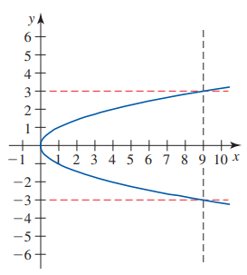
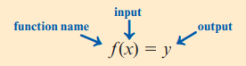
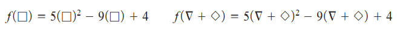
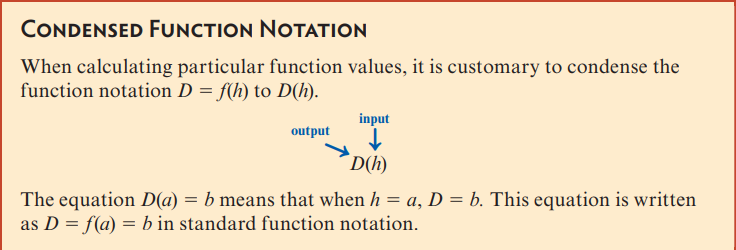

# Mat151 Web Assign Notes

<!-- TOC -->
* [Mat151 Web Assign Notes](#mat151-web-assign-notes)
* [Section 1.1](#section-11)
  * [Decision-Factor Equation](#decision-factor-equation)
* [Section 1.2 - Functions and Function Notation](#section-12---functions-and-function-notation)
  * [Functions](#functions)
  * [Vertical Line Test](#vertical-line-test)
  * [Function Notation](#function-notation)
  * [Evaluating Functions and Solving Function Equations](#evaluating-functions-and-solving-function-equations)
  * [Condensed Function Notation](#condensed-function-notation)
  * [Evaluating and Solving a Function Equation From a Graph](#evaluating-and-solving-a-function-equation-from-a-graph)
  * [Multivariable Functions](#multivariable-functions)
<!-- TOC -->

# Section 1.1

## Decision-Factor Equation

**Decision-factor equations** help to model the decision process in real world
situations when deciding on multiple options that each have multiple variables.

In the table below, a decision-factor equation will be used to decide which car
to buy:

| Car | Mileage |  Price  | Color  |
|:---:|:-------:|:-------:|:------:|
|  1  | 61,671  | $11,495 |  Grey  |
|  2  | 23,258  | $15,997 |  Red   | 
|  3  | 14,865  | $15,995 | Silver | 
|  4  |  5,295  | $16,495 | Silver |
|  5  | 35,671  | $11,995 |  Red   |
|  6  |  3,446  | $16,495 |  Grey  |

1. Assign values to the non-numeric values (In this case, _color_). Red will be
   the first choice, grey the second, and silver the third.
    1. _red = 1_
    2. _grey = 2_
    3. _silver = 3_
2. Create a decision-factor equation: **mileage + price + color**
3. Modify the decision-factor equation to increase the effect that small numbers
   have on the over all equation:  
   **mileage + (4 * price) + (1000 * color)**
4. Create a table if necessary for vizualization

| Car | Mileage | Price   | Color    | DecisionFactor | Rank |
|-----|---------|---------|----------|----------------|------|
| 1   | 61,671  | $11,495 | Grey=2   | 109,651        | 6    |
| 2   | 23,258  | $15,997 | Red=1    | 88,246         | 5    |
| 3   | 14,865  | $15,995 | Silver=3 | 81,845         | 3    | 
| 4   | 5,295   | $16,495 | Silver=3 | 74,275         | 2    | 
| 5   | 35,671  | $11,995 | Red=1    | 84,651         | 4    | 
| 6   | 3,446   | $16,495 | Grey=2   | 71,426         | 1    | 

5. Find the highest or lowest ranked one based off how you created your
   equation.

A decision-factor equation is a **symbolic form**, while a table of data is in
**numeric form**.

A **mathematical model** is an abstract description of a concrete system using
mathematical concepts and language. The process of developing a mathematical
model is termed **mathematical modeling**.

- Mathematical models are helpful in making predictions or solving problems in
  real-world situations.

# Section 1.2 - Functions and Function Notation

## Functions

- **Variables:** A quantity that changes value
- **Constants:** A numeric value that does not change.
- **Function (Single Variable):** A process or correspondence relating two
  quantities in which each input value generates exactly one output value.

Alternatively, a function may be thought of as a correspondence between two 
sets of values. That is, each item from a set of inputs is matched with a single
item from a set of outputs.

Although a function process may be implied in the correspondence, the 
correspondence doesn’t explicitly state what the process is.

- Function correspondences do not have to include numbers.
- An example **what would be a function** would be a credit score. The input is 
  the credit score, and it outputs a single APR. We can assume there is an 
  implicit correspondence that would relate the two values, but cannot state 
  explicitly what that process is.
- An example of **what wouldn't be a function** are airlines destination cities.
  The airline could go to multiple different cities, meaning that there's 
  outputs for the single input.

## Vertical Line Test

- The **vertical line test** may be used to determine if a graph is a function
  or not.
- If the vertical line crosses the graph more than once, it is **not** a 
  function.

## Function Notation

**Function notation** is a formal mathematical notation developed to communicate 
mathematical concepts on a universal scale.

- `x` is the **independent variable**.
- `y` is the **dependent variable**. because the value of `y` depends on the 
  value of `x`.
- This can also be written as **_y = f(x)_**.

## Evaluating Functions and Solving Function Equations

The process of finding the output of a function that corresponds with a given
input is called **evaluating a function**.

- It's also possible to evaluate non-numeric values. The exact same rules apply.

When we say **"Solve _f(c)_ = 6.91"**, it means "find the input value that
correctly corresponds with an output value of 6.91."

## Condensed Function Notation

- Full function notation: **D = _f_(h)**
  - **D = _f_(h) = 8h**
- Condensed function notation: **D(h)**
  - **D(h) = 8h**

## Evaluating and Solving a Function Equation From a Graph

Use the above function definitions and plug the input into the function.

## Multivariable Functions

A function with more than one input, such as:

- The compound interest formula: **A = P(1 + r/n)nt**
- Volume of a box formula: **V = _lwh_**