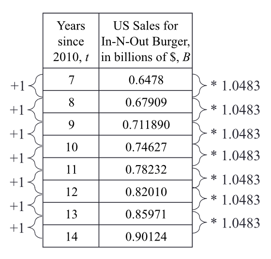
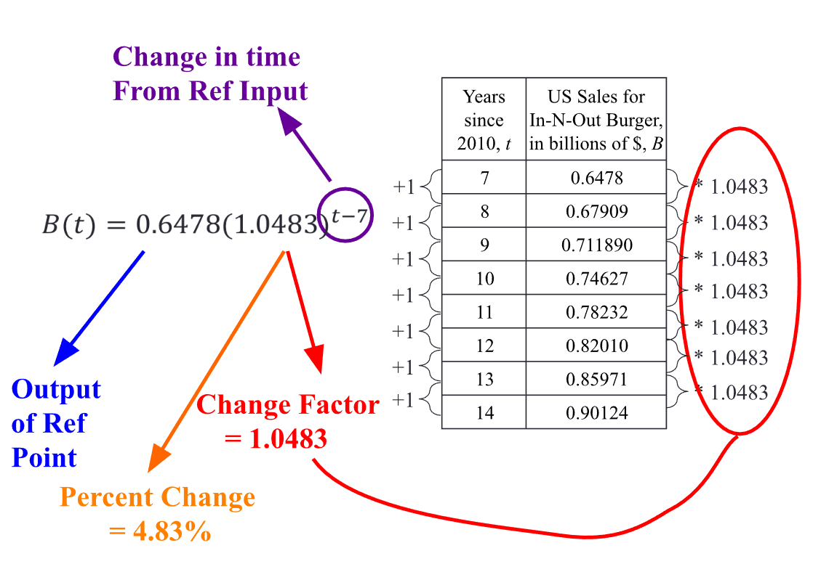
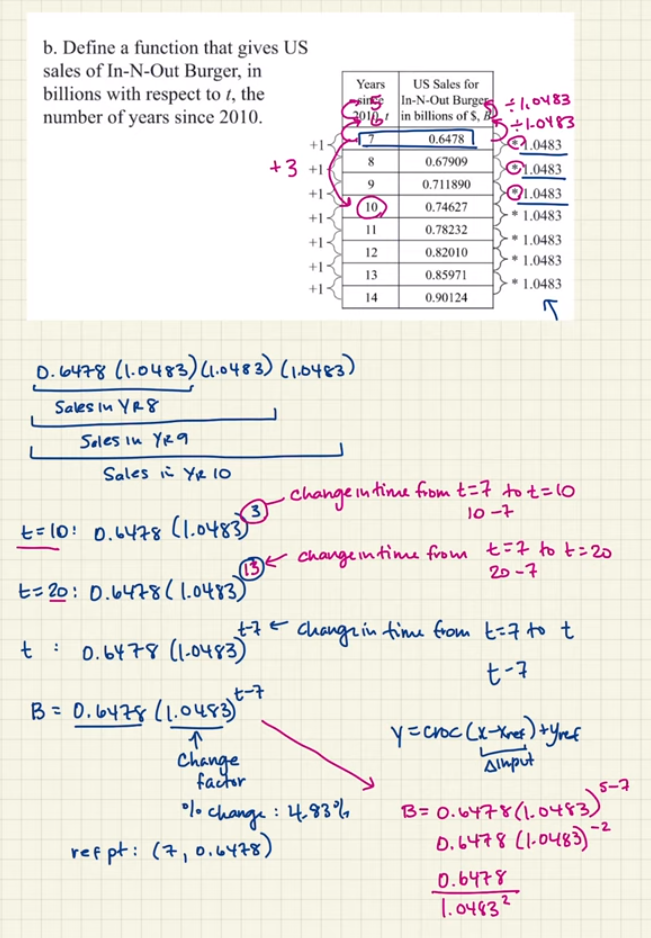
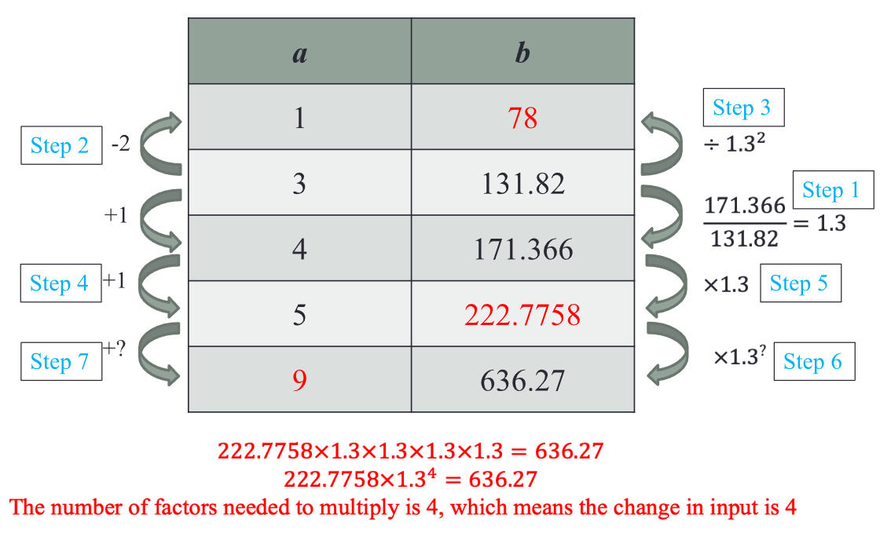
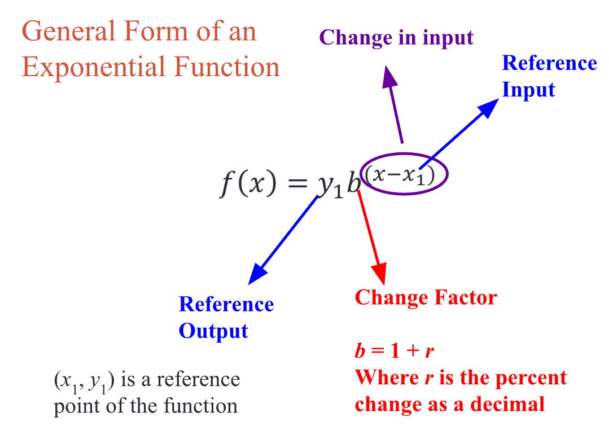

# MAT151 - Unit 2 Notes

# Module 6 - Exponential Functions

- [Google Slide Notes](https://docs.google.com/presentation/d/e/2PACX-1vRiJOQNi7YVfoQlYTg99eu4oC018eSmkMfaK_ZV67jTYosFndZK_SaWhUj2wJF-fBmyZ_kq6_0op-eV/embed?start=false&loop=false&delayms=3000)

## Observing Rate of Change

- Notice that the rate of change of McDonald's US sales with respect to time is
  constant.
- Notice that the rate of change of In-N-Out US sales with respect to time is
  increasing.
  - This should be your first indicator to check for percentage increases and
    possibly an exponential function.
- First you need to find the percentage that it is increasing by. This is done
  by getting the rate of change between each output, and then dividing rate of
  change by **y1**.
  - **To get the percent change: y2 - y1/y1**
  - **To get the change factor: y2/y1**
- The table on the left is **Linear** and the table on the right is
  **Exponential**.
- The general formula for an exponential function is: **y = a * bx**

### Breakdown

### How To Solve

## Change Factor & Percent Change

Although previously _change_ was discussed in terms of _amount of change_ or
_average rate of change_, exponential change is discussed in terms of a _change
factor_ or in terms of _percentage change_.

- **A function is exponential if: For equal changes in the input, the output
  changes by the _same factor_ (or the same percent).**
  - Another way to describe this: **For equal changes in input, the ratio of
    consecutive outputs is constant (and that ratio is the Change Factor).**

### Factor Change vs Percent Change (Independent Research)

A factor change is a ratio of the new value to the old value, while a percent
change is the difference between the new value and the old value, expressed as a
percentage of the old value.

<u>A factor change can be expressed as follows:</u>

- **factor change = new value / old value**

For example, if the _old value_ is **100** and the _new value_ is **150**, the
factor change would be **150/100 = 1.5**.

<u>A percent change can be expressed as follows:</u>

- **percent change = (new value - old value) / old value * 100%**

For example, if the _old value_ is **100** and the _new value_ is **150**, the
percent change would be **(150 - 100) / 100 * 100% = 50%**.

- Percent change is often used to measure the relative change in a quantity,
  while factor change is used to measure the absolute change in a quantity.
- In general, percent change is more useful when comparing changes in different
  quantities, while factor change is more useful when comparing changes in the
  same quantity.

### Example

|  x  |   y   |
|:---:|:-----:|
|  0  |   8   |
|  1  |   6   |
|  2  |  4.5  |
|  3  | 3.375 |

- There is a constant ratio of 0.75 between each output, therefore it is
  exponential.
- **Change Factor: 0.75**
- **Percent Change: -25%**
- **y = 8(0.75)x**

### Completing a Table

- The final input was found by repeatedly multiplying **222.7758** by **1.3** 
  until the value lined up with **636.27**.

### General Form of Exponential Function

## The Exponential Formula and Graphs

**y = abx**

- As the value of the function of **x -> infinity** (gets larger and larger):
  - **f(x)** gets closer and closer to **0**
  - As **x -> infinity**, **f(x) -> 0**
- As the value of the function of **x -> -infinity** (gets more and more negative):
  - **f(x)** gets larger and larger
  - As **x -> -infinity**, **f(x) -> infinity**
- The effect that **a** has on the function of the graph:
  - The **vertical intercept** output value
  - If **a < 0** then there is a vertical reflection.
- The effect that **b** has on the function of the graph:
  - Determines growth or decay:
    - If **b > 1** then growth
    - If **0 < b < 1** then decay
