# MAT151 - Unit 2 Notes

<!-- TOC -->
* [MAT151 - Unit 2 Notes](#mat151---unit-2-notes)
* [Module 6 - Exponential Functions](#module-6---exponential-functions)
  * [Observing Rate of Change](#observing-rate-of-change)
    * [Breakdown](#breakdown)
    * [How To Solve](#how-to-solve)
  * [Change Factor & Percent Change](#change-factor--percent-change)
    * [Factor Change vs Percent Change (Independent Research)](#factor-change-vs-percent-change--independent-research-)
    * [Example](#example)
    * [Completing a Table](#completing-a-table)
    * [General Form of Exponential Function](#general-form-of-exponential-function)
  * [The Exponential Formula and Graphs](#the-exponential-formula-and-graphs)
    * [Effect 1](#effect-1)
    * [Effect 2](#effect-2)
    * [Effect 3](#effect-3)
* [Module 7 - Exponential Functions Continued](#module-7---exponential-functions-continued)
  * [Recall - General Form of an Exponential Function](#recall---general-form-of-an-exponential-function)
  * [One-Year Change Factor](#one-year-change-factor)
  * [Three-Year Change Factor (Multi-year Change Factor / Percent Change)](#three-year-change-factor--multi-year-change-factor--percent-change-)
  * [General Exponential Forms](#general-exponential-forms)
    * [Exponential Function Using One-Unit Change Factor](#exponential-function-using-one-unit-change-factor)
    * [Exponential Function Using _n_-Unit Change Factor](#exponential-function-using-n--unit-change-factor)
  * [Half Life](#half-life)
    * [Example](#example-1)
      * [Calculating the depreciation rate per-year](#calculating-the-depreciation-rate-per-year)
      * [Calculating the value after 10 years](#calculating-the-value-after-10-years)
    * [Example 2](#example-2)
      * [Method 1](#method-1)
      * [Method 2](#method-2)
  * [Doubling Time](#doubling-time)
    * [Example](#example-2)
  * [Exponential Regression](#exponential-regression)
* [Module 8 - Logarithmic Functions](#module-8---logarithmic-functions)
  * [Solving for the Inverse Function Using Log](#solving-for-the-inverse-function-using-log)
    * [Example 1](#example-1)
    * [Example 2](#example-2-1)
    * [Example 3](#example-3)
    * [Example 4](#example-4)
  * [Common and Natural Logarithms](#common-and-natural-logarithms)
    * [Change of Base Formula](#change-of-base-formula)
  * [Logarithm Rules](#logarithm-rules)
  * [Graphic Logarithmic Functions](#graphic-logarithmic-functions)
    * [The inverse](#the-inverse)
    * [Examples](#examples)
  * [Summary](#summary)
<!-- TOC -->

# Module 6 - Exponential Functions

- [Google Slide Notes](https://docs.google.com/presentation/d/e/2PACX-1vRiJOQNi7YVfoQlYTg99eu4oC018eSmkMfaK_ZV67jTYosFndZK_SaWhUj2wJF-fBmyZ_kq6_0op-eV/embed?start=false&loop=false&delayms=3000)

## Observing Rate of Change

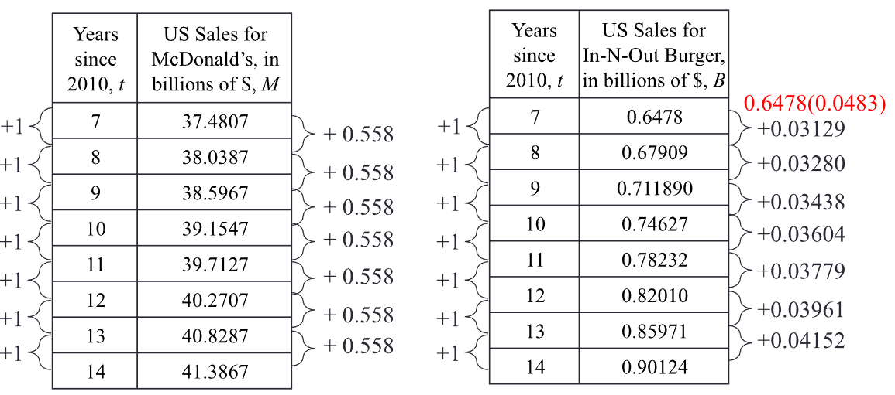

- Notice that the rate of change of McDonald's US sales with respect to time is
  constant.
- Notice that the rate of change of In-N-Out US sales with respect to time is
  increasing.
    - This should be your first indicator to check for percentage increases and
      possibly an exponential function.
- First you need to find the percentage that it is increasing by. This is done
  by getting the rate of change between each output, and then dividing rate of
  change by **y1**.
    - **To get the percent change: y2 - y1
      /y1**
    - **To get the change factor: y2/y
      1**
- The table on the left is **Linear** and the table on the right is
  **Exponential**.
- The general formula for an exponential function is: **y = a * bx**

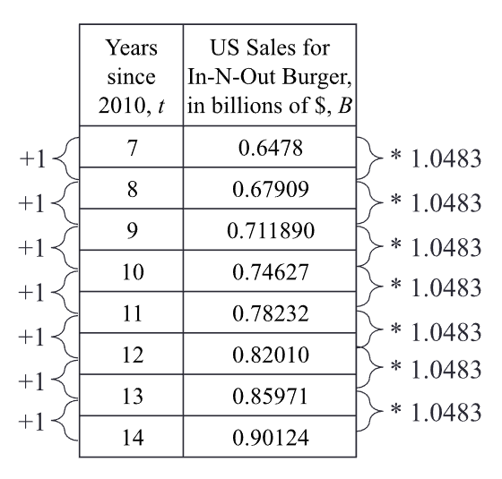

### Breakdown

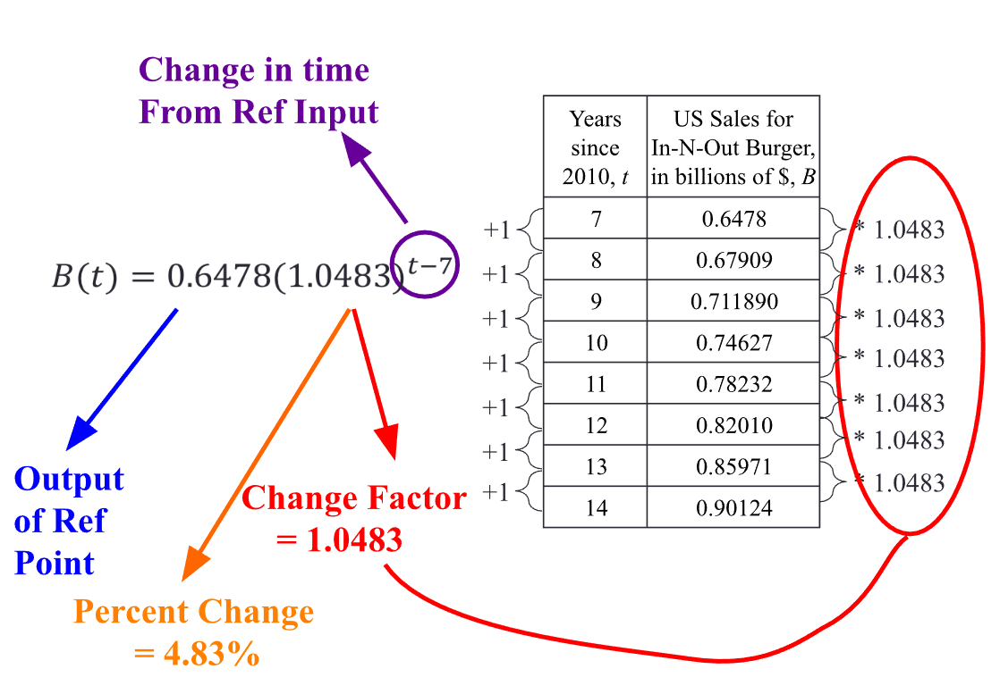

### How To Solve

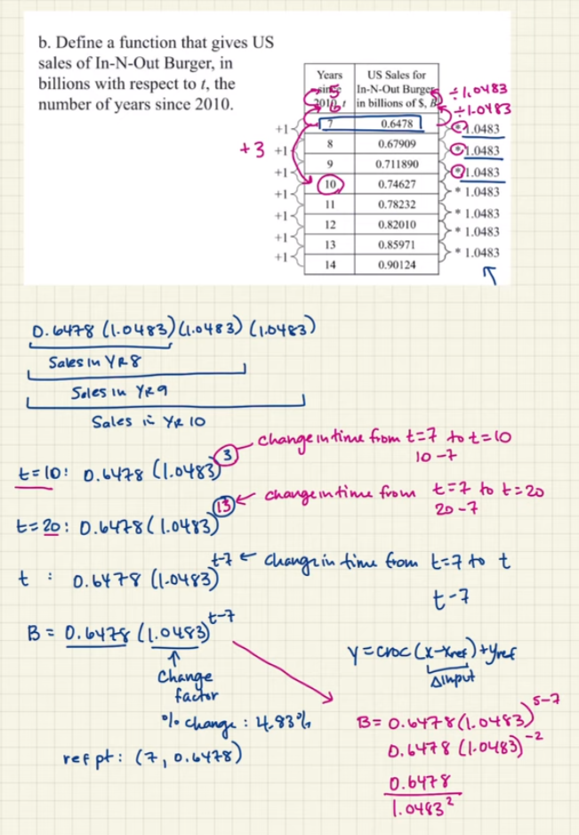

## Change Factor & Percent Change

Although previously _change_ was discussed in terms of _amount of change_ or
_average rate of change_, exponential change is discussed in terms of a _change
factor_ or in terms of _percentage change_.

- **A function is exponential if: For equal changes in the input, the output
  changes by the _same factor_ (or the same percent).**
    - Another way to describe this: **For equal changes in input, the ratio of
      consecutive outputs is constant (and that ratio is the Change Factor).**

### Factor Change vs Percent Change (Independent Research)

A factor change is a ratio of the new value to the old value, while a percent
change is the difference between the new value and the old value, expressed as a
percentage of the old value.

<u>A factor change can be expressed as follows:</u>

- **factor change = new value / old value**

For example, if the _old value_ is **100** and the _new value_ is **150**, the
factor change would be **150/100 = 1.5**.

<u>A percent change can be expressed as follows:</u>

- **percent change = (new value - old value) / old value * 100%**

For example, if the _old value_ is **100** and the _new value_ is **150**, the
percent change would be **(150 - 100) / 100 * 100% = 50%**.

- Percent change is often used to measure the relative change in a quantity,
  while factor change is used to measure the absolute change in a quantity.
- In general, percent change is more useful when comparing changes in different
  quantities, while factor change is more useful when comparing changes in the
  same quantity.

### Example

|  x  |   y   |
|:---:|:-----:|
|  0  |   8   |
|  1  |   6   |
|  2  |  4.5  |
|  3  | 3.375 |

- There is a constant ratio of 0.75 between each output, therefore it is
  exponential.
- **Change Factor: 0.75**
- **Percent Change: -25%**
- **y = 8(0.75)x**

### Completing a Table

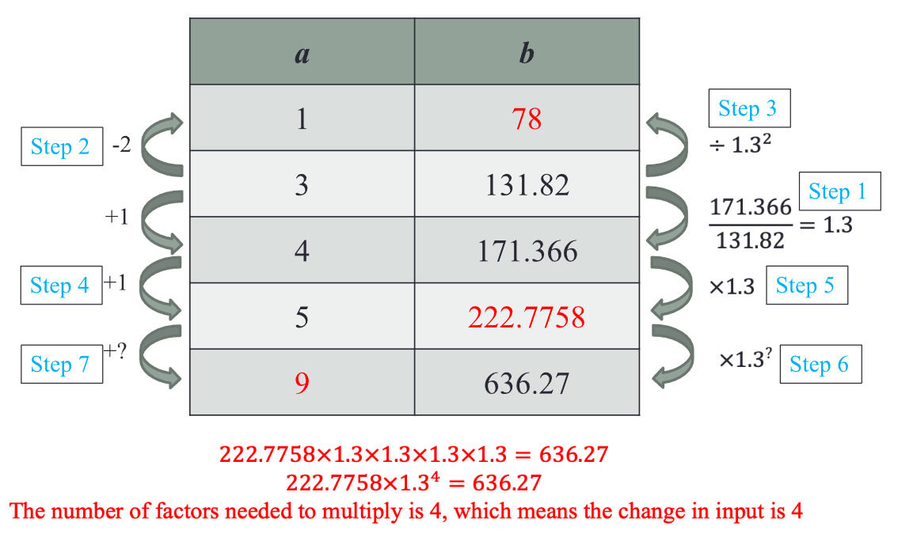

- The final input was found by repeatedly multiplying **222.7758** by **1.3**
  until the value lined up with **636.27**.

### General Form of Exponential Function

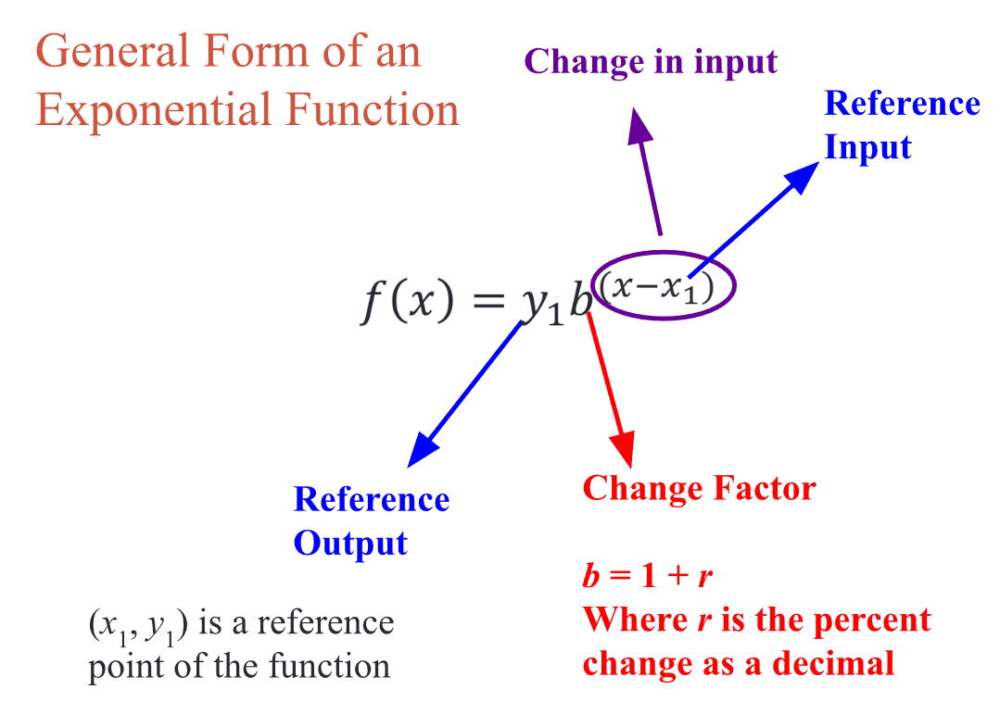

## The Exponential Formula and Graphs

**f(x) = abx**

### Effect 1

- As the value of the function of **x -> infinity** (gets larger and larger):
    - **f(x)** gets closer and closer to **0**
    - As **x -> infinity**, **f(x) -> 0**
- As the value of the function of **x -> -infinity** (gets more and more
  negative):
    - **f(x)** gets larger and larger
    - As **x -> -infinity**, **f(x) -> infinity**

### Effect 2

- The effect that **a** has on the function of the graph:
    - The **vertical intercept** output value
    - If **a < 0** then there is a vertical reflection.
- The effect that **b** has on the function of the graph:
    - Determines growth or decay:
        - If **b > 1** then growth
        - If **0 < b < 1** then decay

### Effect 3

- If the coefficient **a** in an exponential formula is 0, it means that the
  exponential function will always evaluate to 0, regardless of the value of
  the exponent.
    - For example, if the exponential function is **f(x) = 0 * b^x**, then **f(
      x) =
      0** for any value of **x**. This means that the exponential function is
      not
      increasing or decreasing, but stays constant at a value of **0**.
- If the base **b** is also **0**, then the exponential function is undefined,
  since it would involve dividing by **0**.

# Module 7 - Exponential Functions Continued

[Google Slides](https://docs.google.com/presentation/d/e/2PACX-1vQmiaoilQcgkqIcmyH17lHoJ1LHSm94B_dzSJha7p6vvYkbkRJj9YZeGDFNZu1a1OaMz7jQzSaTwodd/embed?start=false&loop=false&delayms=3000)

## Recall - General Form of an Exponential Function

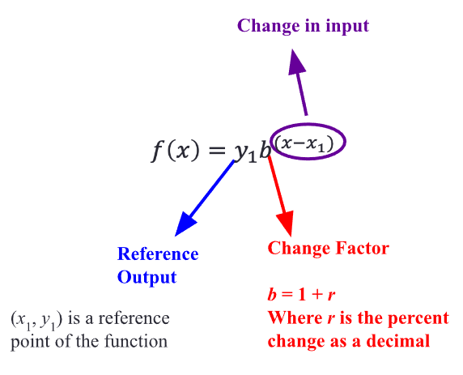

## One-Year Change Factor

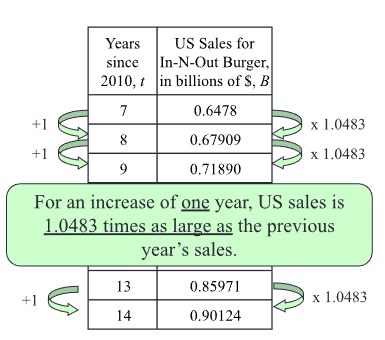

## Three-Year Change Factor (Multi-year Change Factor / Percent Change)

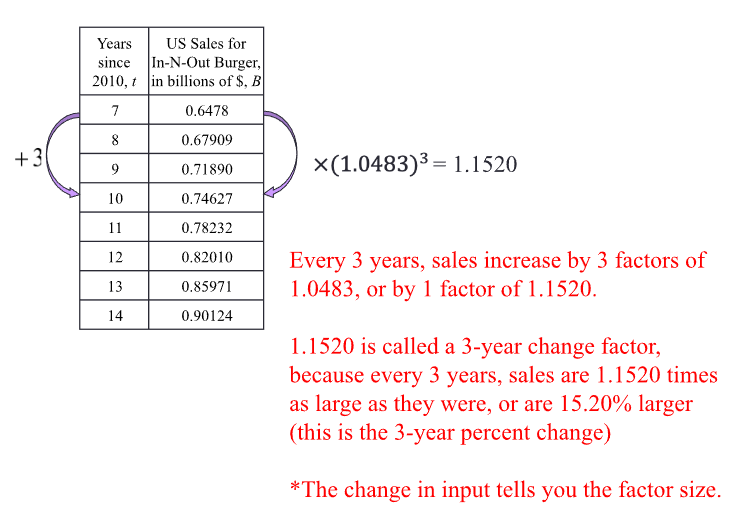

- You get the change factor of several years worth by getting the one-year 
  change factor first (**1.0483**), and then putting it to the power of the change
  in input.

In order to use the 3-year change factor of **1.1520** to get the 6-year and the
10-year changes:

1. **6-year: 1.15202 = (1.04833)2 = 1.3271**
2. **10-year: 1.152010/3 = (1.15201/3)10 =
   1.6027**

- _It's important to note that there can be a difference in value when using
  multi-year change factors due to rounding._

## General Exponential Forms

### Exponential Function Using One-Unit Change Factor

### Exponential Function Using _n_-Unit Change Factor

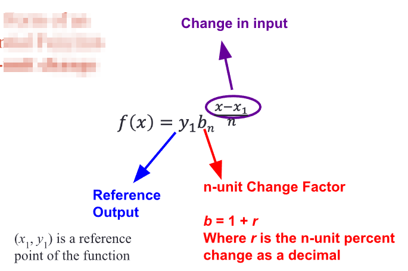

## Half Life

The **half-life** of a substance is the amount of time it takes for half of the
intial amount of the substance to remain.

- When given the half-life, the _n_-unit change factor is **always 0.5** and 
  _n_ is always the size of the half-life.

### Example

A car has a value of **$24,000** with a half-life of **7 years**.

#### Calculating the depreciation rate per-year

1. **(0.5)1/7**
2. **Change Factor = 0.9057**
3. **Percent Change = -9.43%**

#### Calculating the value after 10 years

1. **24000(0.5)10/7**
2. **8915.97 dollars**

### Example 2

After starting with 78 micrograms, the mass of bacteria decreases by
35% every 2 hours.

Determine the half life of the bacteria.

#### Method 1

- The 2-hour change factor: **0.65**
- The 1-hour change factor: **(0.65)1/2 = 0.8062**

The formula: **(0.8062)x = 0.5**

We will solve this graphically:

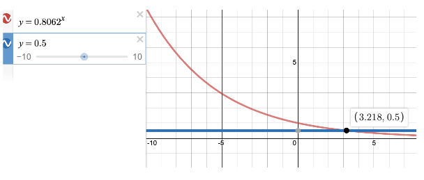

#### Method 2

1. Define variables
   - **_t_ = time elapsed in hours**
   - **_m_ = mass of bacteria in micrograms**
2. Write a formula: **m = 78(0.65)_t_/2**
3. Find half the amount of the original amount: **78(0.5) = 39**
4. Substitute the found value into the formula: 
   **39 = 78(0.65)_t_/2**
5. Solve it graphically

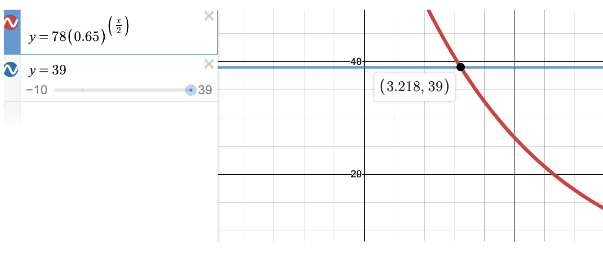

## Doubling Time

**Doubling time** is the amount of time it takes for something that is growing
to double.

- When given the doubling time, the _n_-unit change factor is **always** 2 and
  _n_ is always the size of the doubling time.

### Example

Suppose you have bacteria with a mass of 12 micrograms and that the doubling
time of this bacteria was 8 hours.

1. Determine the percent that the mass of bacteria increase by each hour. 
2. Define a formula for the function that gives the mass of bacteria m in
   micrograms after ¢ hours.

Since the doubling time is 8 hours, the 8-hour change factor is **2**.

- The 1-hour change factor: **(2)1/8= 1.0905**
- the 1-hour percent change: **9.05%**.

The formula would be: **m = 12(2)t/8**

## Exponential Regression

In the real world, there are datasets that aren't quite exponential but are
close. When this happens, we create an **exponential model** _(an exponential
funciton that models the data)_.

- We do this using **Exponential Regression**.

_How to do exponential regression in desmos:_ <https://www.youtube.com/watch?v=XnOzmfdbaXU>

- Be sure to select **Log Mode** on Desmos for Exponential Regression. If you
  forget to do so, your models will be slightly different.

# Module 8 - Logarithmic Functions

- [Google Slides](https://docs.google.com/presentation/d/e/2PACX-1vQy816nJ5KdVOCOR0qKdIM5wvgO6qvTnBw75eABfzs6xcdEo6641hOGEyg9bBbpdlcvsXGONwMgliYc/embed?start=false&loop=false&delayms=3000&slide=id.p1)
- **log** is short for **logarithm**

For solving for the double time, graphing was used before using, as an example,
**(1.0420)x = 2** with it being graphed to find the number. To solve
this algebraically, you would need to use a **logarithmic function**.

When given a function like **_f_(exp) = 2exp**:

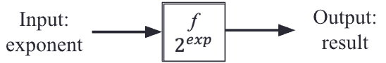

In order to solve it, you need to find the inverse:

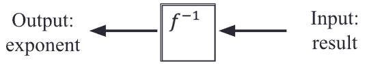

## Solving for the Inverse Function Using Log

### Example 1

Assume we know the output of **_f_** is 8 and are looking to 
solve **2exp = 8**, use the inverse function, 
**f-1(8) = 3**.

- This is because **23 = 8**

Another example: 

1. **_2exp = 32_**
2. Find how many times **2** goes into **32**
3. The inverse: **f-1(32) = 5**
   - Because **25 = 32**

### Example 2

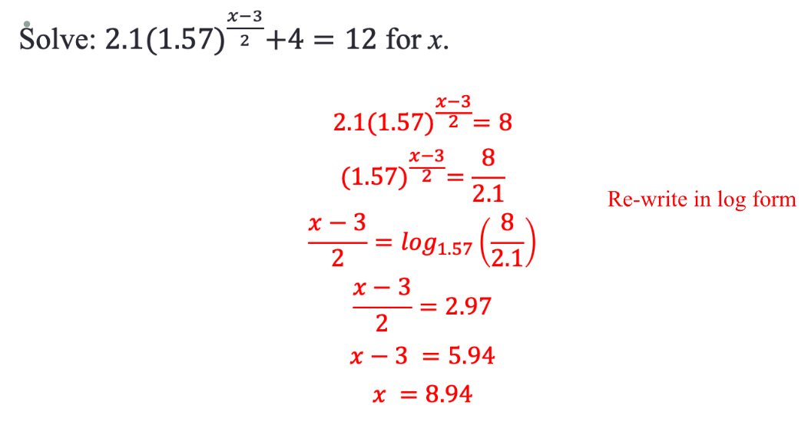

- Try to keep things as fractions to preserve accuracy

### Example 3

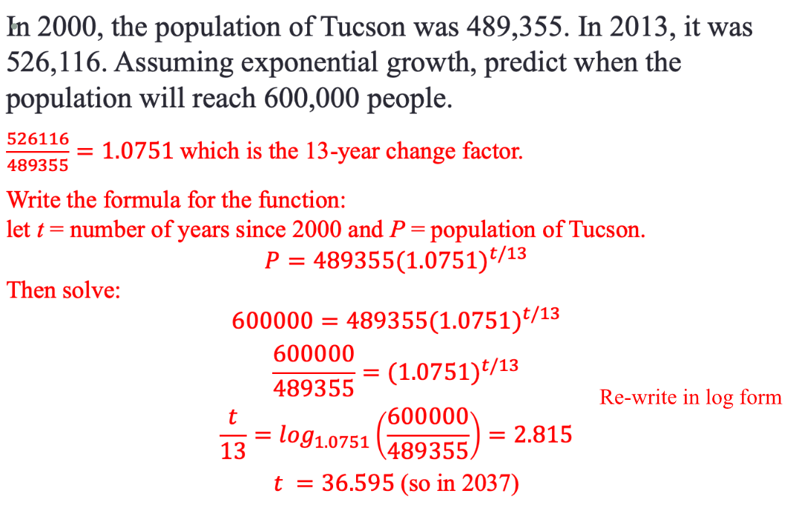

- Try to keep things as fractions to preserve accuracy

### Example 4

1. **g(x) = 19(0.77)3x**
2. **g(x) = 19(0.773)x**
3. **0.773** is the change factor

--- 

The inverse function is known as the **Logarithmic Function**:

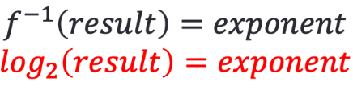

_Text Versions:_

- **f-1(result) = exponent**
- **log2(result) = exponent**

You would read **log2(8) = 3** as "log base 2 of 8 equals 3".

- The _result_ is the input and the _exponent_ on the base of 2 is the output.

<u>Find the inverse function of _any_ exponential function:</u>

- **y = logb(x)** is the inverse function for **by = x**

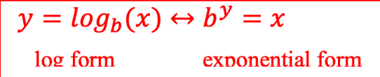

- Think of it as "What exponent is necessary on **b** to get **x**?"

## Common and Natural Logarithms

Common and Natural logarithms are logarithms that are used so frequently that 
they have special names:

- **Common Log: log10(x)**
  - It's common to omit the **10** and write it as **log(x)**
  - **y = log(x)** means "What exponent on 10 gives us **x**?"
  - **x = 10y**
- **Natural Log: loge(x)**
  - **e ~= 2.71828** also called the _natural number_
  - When writing the natural log, you write **ln(x)** instead of 
    **loge(x)**.

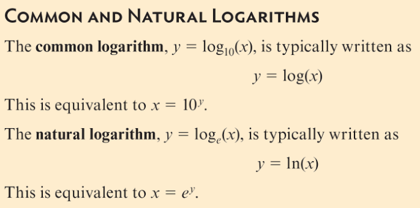

### Change of Base Formula

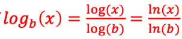

## Logarithm Rules

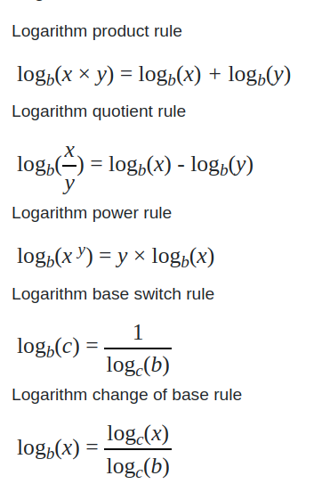

## Graphic Logarithmic Functions

- Great for determining from a scatter plot if a logarithmic model is
  appropriate for a particular real-world situation.

<u>Function:</u> **y = 2x**

<u>Table:</u>

| **x** |           **y**           |
|:-----:|:-------------------------:|
|  -2   | 1/4 |
|  -1   | 1/2 |
|   0   |             1             |
|   1   |             2             |
|   2   |             4             |

<u>Graph:</u>

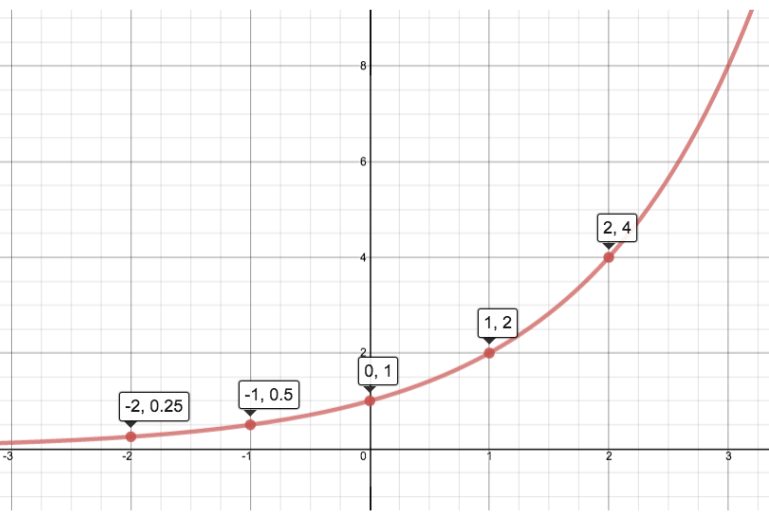

- The function has a **_horizontal_ asymptote at y = 0**
  - As **x** gets larger and larger in the negative direction, the value of y
    gets closer and closer to 0.

### The inverse 

**x = log2y**

<u>Table:</u>

|           **y**           | **x** |
|:-------------------------:|:-----:|
| 1/4 |  -2   |
| 1/2 |  -1   |
|             1             |   0   |
|             2             |   1   |
|             4             |   2   |

<u>Graph:</u>

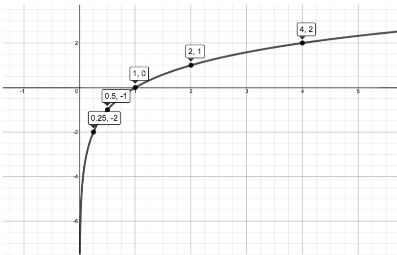

- The function has a **_vertical_ asymptote at 0**.
  - As the input approaches 0, the output starts to reach positive or negative
    infinity.

### Examples

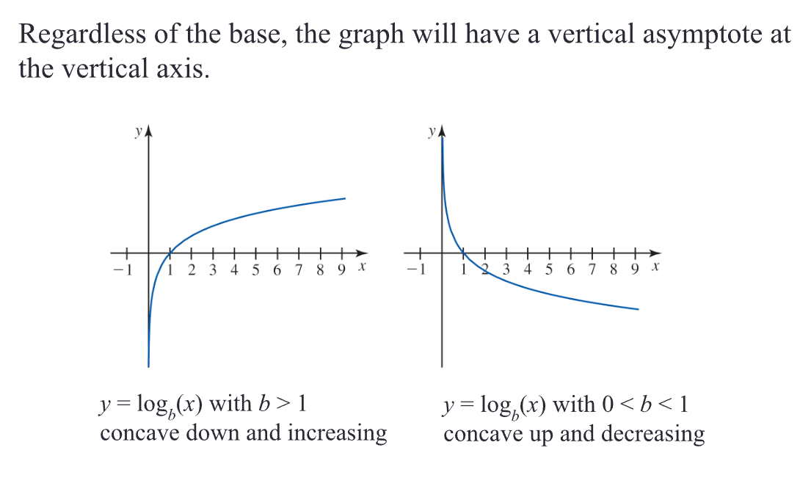

## Summary

- [Summary of all log notes](assets/logarithmic_functions_summary.pdf)

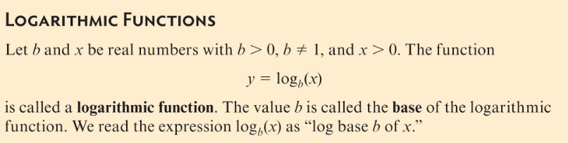

A logarithmic function is the inverse of an exponential function.

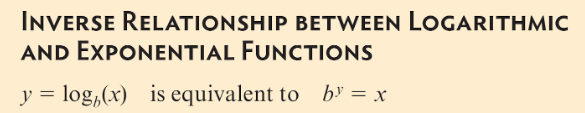