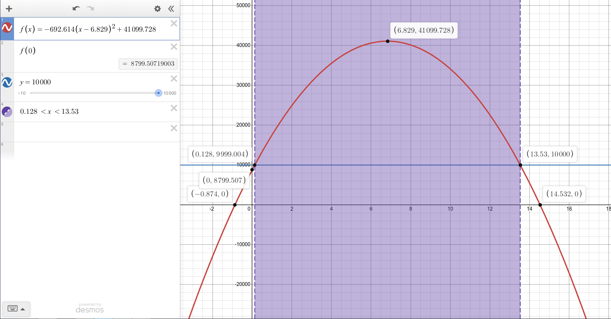
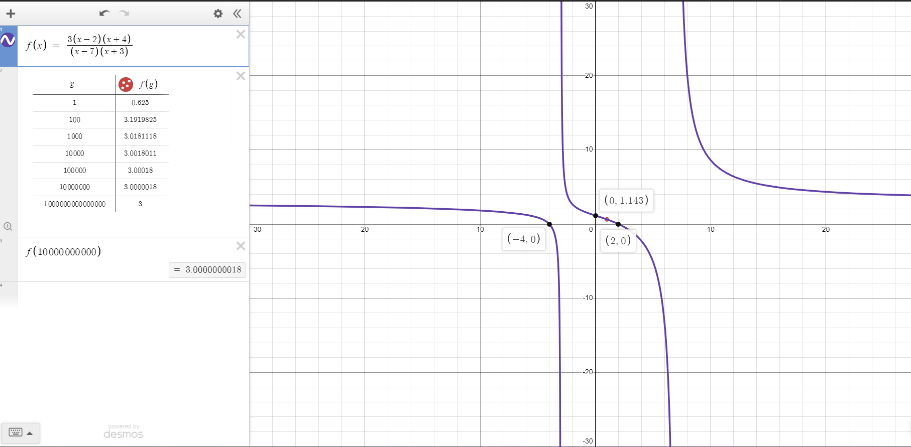

# Unit 3 - Function Transformations, Quadratic, Polynomial and Rational Functions

<!-- TOC -->
* [Unit 3 - Function Transformations, Quadratic, Polynomial and Rational Functions](#unit-3---function-transformations-quadratic-polynomial-and-rational-functions)
* [General Notes](#general-notes)
* [Module 10 - Function Transformation & Quadratic Functions](#module-10---function-transformation--quadratic-functions)
  * [Transformations Activity](#transformations-activity)
  * [Writing a Function In Terms of a Function](#writing-a-function-in-terms-of-a-function)
    * [When setting _a = 2_:](#when-setting-a--2-)
    * [When setting _d = 2_:](#when-setting-d--2-)
    * [When setting _c = 1_:](#when-setting-c--1-)
  * [Vertex of a Function](#vertex-of-a-function)
    * [Vertex Example 1](#vertex-example-1)
    * [Vertex Example 2](#vertex-example-2)
* [Module 11 - Quadratic & Higher-Order Polynomial Functions](#module-11---quadratic--higher-order-polynomial-functions)
  * [Module 11 - Google Slides](#module-11---google-slides)
  * [Quadratic Functions](#quadratic-functions)
  * [Vertex Form of a Quadratic Function](#vertex-form-of-a-quadratic-function)
  * [Different Forms of a Quadratic Function](#different-forms-of-a-quadratic-function)
    * [Standard Form](#standard-form)
    * [Factored Form](#factored-form)
    * [Vertex Form](#vertex-form)
  * [Problems In Different Forms](#problems-in-different-forms)
    * [Problem in Vertex Form](#problem-in-vertex-form)
    * [Problem in Factored Form](#problem-in-factored-form)
    * [Problem in Standard Form (Converting to Standard Form)](#problem-in-standard-form--converting-to-standard-form-)
    * [Converting to Vertex Form](#converting-to-vertex-form)
  * [Concavity](#concavity)
  * [Inflection Point](#inflection-point)
  * [Cubic Functions](#cubic-functions)
    * [Cubic Function Example 1](#cubic-function-example-1)
    * [Cubic Function Example 2](#cubic-function-example-2)
    * [Cubic Function Example 3](#cubic-function-example-3)
  * [Polynomial Functions](#polynomial-functions)
    * [Polynomial Function Examples](#polynomial-function-examples)
      * [Polynomial Example 1](#polynomial-example-1)
      * [Polynomial Example 2](#polynomial-example-2)
      * [Polynomial Example 3](#polynomial-example-3)
      * [Polynomial Example 4](#polynomial-example-4)
      * [Polynomial Example 5](#polynomial-example-5)
  * [Graphs of Polynomial Functions](#graphs-of-polynomial-functions)
  * [End Behavior of Polynomial Functions](#end-behavior-of-polynomial-functions)
    * [Determining End-Behavior](#determining-end-behavior)
      * [Function 1](#function-1)
      * [Function 2](#function-2)
      * [Function 3](#function-3)
      * [Function 4](#function-4)
      * [Function 5](#function-5)
  * [Relative and Absolute Extrema of Polynomial Functions](#relative-and-absolute-extrema-of-polynomial-functions)
    * [Relative Extrema of Polynomial Functions](#relative-extrema-of-polynomial-functions)
    * [Absolute Extrema of Polynomial Functions](#absolute-extrema-of-polynomial-functions)
  * [Identifying All Points On a Graph](#identifying-all-points-on-a-graph)
    * [Example 1](#example-1)
    * [Example 2](#example-2)
  * [Computing and Graphing a Cubic Function](#computing-and-graphing-a-cubic-function)
* [Module 12 - Rational Functions](#module-12---rational-functions)
  * [Module 12 - Google Slides](#module-12---google-slides)
  * [Rational Functions](#rational-functions)
  * [Vertical Asymptotes](#vertical-asymptotes)
    * [Vertical Asymptote Graph Example](#vertical-asymptote-graph-example)
  * [Horizontal Asymptotes](#horizontal-asymptotes)
  * [Finding The Vertical and Horizontal Asymptote](#finding-the-vertical-and-horizontal-asymptote)
    * [Finding The Asymptotes Example 1](#finding-the-asymptotes-example-1)
    * [Finding The Asymptotes Example 2](#finding-the-asymptotes-example-2)
    * [Finding The Asymptotes Example 3](#finding-the-asymptotes-example-3)
    * [Finding The Asymptotes Example 4](#finding-the-asymptotes-example-4)
    * [Finding The Asymptotes Example 5](#finding-the-asymptotes-example-5)
    * [Finding The Asymptotes Example 6](#finding-the-asymptotes-example-6)
    * [Finding The Asymptotes Example 7](#finding-the-asymptotes-example-7)
    * [Finding The Asymptotes Example 8](#finding-the-asymptotes-example-8)
  * [Finding Horizontal Asymptotes With Leading Terms](#finding-horizontal-asymptotes-with-leading-terms)
    * [Horizontal Asymptote - Leading Term Example 1](#horizontal-asymptote---leading-term-example-1)
    * [Horizontal Asymptote - Leading Term Example 2](#horizontal-asymptote---leading-term-example-2)
    * [Horizontal Asymptote - Leading Term Example 3](#horizontal-asymptote---leading-term-example-3)
    * [Horizontal Asymptote - Leading Term Example 4](#horizontal-asymptote---leading-term-example-4)
    * [Horizontal Asymptote - Leading Term Example 5](#horizontal-asymptote---leading-term-example-5)
* [Module 13 - Power Functions](#module-13---power-functions)
  * [Module 13 - Google Slides](#module-13---google-slides)
  * [Power Functions](#power-functions)
  * [Power Functions vs Polynomial Functions](#power-functions-vs-polynomial-functions)
  * [Power Function Graphs](#power-function-graphs)
    * [Power Function Graph - `x > 0` and `0 < b < 1`](#power-function-graph---x--0-and-0--b--1)
    * [Power Function Graph - `x > 0` and `b < 0`](#power-function-graph---x--0-and-b--0)
    * [Power Function Graph - Multiple Power Functions](#power-function-graph---multiple-power-functions)
  * [Solving Power Functions](#solving-power-functions)
    * [Solving Equations of Power Functions - Example 1](#solving-equations-of-power-functions---example-1)
      * [Example 1 Graph](#example-1-graph)
    * [Solving Equations of Power Functions - Example 2](#solving-equations-of-power-functions---example-2)
    * [Solving Equations of Power Functions - Example 3](#solving-equations-of-power-functions---example-3)
    * [Solving Equations of Power Functions - Example 4](#solving-equations-of-power-functions---example-4)
<!-- TOC -->

# General Notes

# Module 10 - Function Transformation & Quadratic Functions

## Transformations Activity

- [Overall Guide](assets/function_transformations_big_ideas.pdf)

Functions can be transformed in various ways:

- Stretched or compressed vertically or horizontally
- Shifted up or down, or left or right

<u>Transformation Activity:</u> <https://www.desmos.com/calculator/fneiikwfiy>

Two defined functions:

1. **&fnof;(x) = x2**
2. **_g_(x) = a&fnof;(x - c) + d**

- **a**, **c**, and **d** are parameters.
- In this scenario, **f** is the **parent function** and **g** is the
  **transformed / image function**.
- **d** moves the vertical offset by **d** and shifts the graph up or down.
- **a** is the slope and stretches or compresses the graph vertically by a
  factor of **a** and can create a **vertical reflection**.
    - **1 < a:** The graph is stretched vertically (narrower than original)
    - **0 < a < 1:** The graph is compressed vertically (wider than original
      graph)
    - **a < 0:** Creates a vertical reflection.
- **c** moves the horizontal intercept by **c** and shifts the graph left or
  right.
    - **c < 0:** The shift is to the left.
    - **c > 0:** The shift is to the right.
    - In a table, the output of the parent function is moved by **c** places
      down or up.

## Writing a Function In Terms of a Function

### When setting _a = 2_:

|  x  | &fnof;(x) | _g_(x) |
|:---:|:---------:|:------:|
| -5  |    25     |   50   |
| -4  |    16     |   32   |
| -3  |     9     |   18   |
| -2  |     4     |   8    |
| -1  |     1     |   2    |
|  0  |     0     |   0    |
|  1  |     1     |   2    |
|  2  |     4     |   8    |
|  3  |     9     |   18   |
|  4  |    16     |   32   |
|  5  |    25     |   50   |

- A formula for the function **g** in terms of **f**:  
  **_g_(x) = 2&fnof;(x)**
- Given that **&fnof;(x) = x2**, a formula for the function **g** in
  terms of **f**:  
  **_g_(x) = 2x2**

---

### When setting _d = 2_:

|  x  | &fnof;(x) | _g_(x) |
|:---:|:---------:|:------:|
| -5  |    25     |   27   |
| -4  |    16     |   18   |
| -3  |     9     |   11   |
| -2  |     4     |   6    |
| -1  |     1     |   3    |
|  0  |     0     |   2    |
|  1  |     1     |   3    |
|  2  |     4     |   6    |
|  3  |     9     |   11   |
|  4  |    16     |   18   |
|  5  |    25     |   27   |

- A formula for the function **g** in terms of **f**:  
  **_g_(x) = &fnof;(x) + 2**
- Given that **&fnof;(x) = x2**, a formula for the function **g** in
  terms of **f**:  
  **_g_(x) = x2 + 2**

---

### When setting _c = 1_:

|  x  | &fnof;(x) | _g_(x) |
|:---:|:---------:|:------:|
| -5  |    25     |   36   |
| -4  |    16     |   25   |
| -3  |     9     |   16   |
| -2  |     4     |   9    |
| -1  |     1     |   4    |
|  0  |     0     |   1    |
|  1  |     1     |   0    |
|  2  |     4     |   1    |
|  3  |     9     |   4    |
|  4  |    16     |   9    |
|  5  |    25     |   16   |

- A formula for the function **g** in terms of **f**:  
  **_g_(x) = &fnof;(x - 1)**
- Given that **&fnof;(x) = x2**, a formula for the function **g** in
  terms of **f**:  
  **_g_(x) = (x - 1)2**

---

## Vertex of a Function

The vertex is the point where the maximum or minimum occurs of the function.

### Vertex Example 1

**_g_(x) = 2&fnof;(x) + 3**

- Vertical stretch by a factor of **2**
- Vertical stretch up **3**
- Vertex: **(0, 3)**

### Vertex Example 2

**_h_(x) = &fnof;(x + 2) - 1**

- Horizontal shift left **2**
- Vertical shift down **1**
- Vertex: **(-2, -1)**

# Module 11 - Quadratic & Higher-Order Polynomial Functions

## Module 11 - Google Slides

> - **Google Slides:** 
> [Link to slides](https://docs.google.com/presentation/d/e/2PACX-1vRZf0--QHmeWmMDxhLi4GE_0n-5RLGXaWfmuEAwhrSxwA0pRx8f_fumb9DhNeP-wsUpVrkG2Xer3kSz/embed?start=false&loop=false&delayms=3000)
>
> 

## Quadratic Functions

Basic quadratic function: **&fnof;(x) = x2**

- Graph is called **parabolic**
- Shape is open _up_ if **&fnof;(x) = x2**
- Shape is open _down_ if **&fnof;(x) = -x2**
- Both ends point in the same direction
- The graph will have a maximum or a minimum
    - This occurs at the vertex
- They are symmetric
    - The axis of symmetry passes through the vertex

There are two types of parabolas:

- **Concave down**
    - Has a maximum value at the vertex
    - Does not have a minimum
- **Concave up**
    - Has a minimum value at the vertex
    - Does not have a maximum

## Vertex Form of a Quadratic Function

**y = _a_(x - h)2 + k**

- The function above with **a != 0** is in **vertex form**.
- The point _(h, k)_ is called the **vertex** of the parabola.
- The effect of the different variables:
    - **a** is a vertical stretch/compression/reflection
    - **h** is a horizontal shift left/right
    - **k** is a vertical shift up/down
- **h** is the input reference and **k** is the output reference
    - _(h, k)_ is the reference point

## Different Forms of a Quadratic Function

* In some forms, the **vertex** of a function is easier to determine.
* In other forms, vertical/horizontal intercept are easier to determine.

### Standard Form

> **y = ax2 + bx + c**

- In this form, **c** will always be the **vertical intercept**.

### Factored Form

> **y = a(x - x1)(x - x2)**

- In this form, **x - x1 = 0** and **x - x2 = 0** can be
  used to find the **horizontal intercepts** _(or **zeros**)_ of the graph.

### Vertex Form

> **y = _a_(x - h)2 + k**

- In this form, **(h, k)** will always be the **vertex** of the function and
  either the **minimum** or the **maximum** depending on if the graph is
  **concave up** or **concave down**.
    - The concavity can be determined by the sign of **a**.
        - **-x** is concave down
        - **x** is concave up

## Problems In Different Forms

### Problem in Vertex Form

According to the CDC, the number of AIDS cases among people aged 21 or younger
in the US is finally starting to decline after seeing many years of increase.

The function that models the number of cases with respect to the number of years
since 2004 is:  
**_N_(x) = -692.614(x - 6.829)2 + 41099.728**

1. Determine approximately when the number of AIDS cases was at its peak.
   What was the maximum number?
    1. Identify whether the graph is concave up or concave down based off if
       **a** is negative. **It's concave down**.
    2. Determine the maximum (because it's concave down) by finding the
       vertex
    3. Vertex is **[6.829, 41099.728]**, so the answer is **6.829**
2. Identify and explain the vertical intercept of the function.
    - **Option 1**
        1. Graph the function
        2. Create another entry using **0** as **&fnof;(x)**: **&fnof;(0)**
    - **Option 2**
        1. Substitute **0** into the equation, because it turns into: 
           **&fnof;(0) = -692.614(x - 6.829)2 + 41099.728**
        2. **&fnof;(0) = -692.614(0 - 6.829)2 + 41099.728**
        3. **&fnof;(0) = -692.614(6.829)2 + 41099.728**
        4. **&fnof;(0) = -692.614(46.635) + 41099.728**
        5. **&fnof;(0) = -32300.221 + 41099.728**
        6. **&fnof;(0) = 8799.507** &rarr; **8799.51**
3. Determine when the model would predict AIDS cases is zero (Horizontal intercept).
    - **Option 1**
      1. Graph the function
      2. Find the horizontal intercepts
      3. Answer: **~1 year before 2004 and ~14.5 years after 2004**
   - **Option 2**
     1. Set the equation equal to **0**, turning it into: 
        **0 = -692.614(x - 6.829)2 + 41099.728**
     2. **-41099.728 = -692.614(x - 6.829)2**
     3. **-41099.728&frasl;-692.614 = (x - 6.829)2**
     4. **&radic;(-41099.728&frasl;-692.614) = x - 6.829**
     5. **&radic;(-41099.728&frasl;-692.614) + 6.829 = x**
     6. Solve
     7. **x = 14.53224731** &rarr; **14.53**
4. Determine the range of years we would expect the number of cases to be at
   least 10,000.
    1. Graph the function
    2. Plot a separate line that is 10,000
    3. Determine where the line intersects with the graph
    4. _Optional: Use inequalities to create a section visualizing it._
    5. **Answer: 0.128 <= x <= 13.53**

### Problem in Factored Form

A water rocket can be purchased at many toy stores. One company claims that
the height above the ground (in feet) for their rocket _t_ seconds after it is
launched can be modeled by:
> **_s_(t) = -16(t + 0.03)(t - 4.03)**

1. Determine the vertical intercept of the function and explain its meaning
   (if any) in the context of the problem.
    1. Graph the chart
    2. Find the vertical intercept
    3. **[0, 1.934]**
    4. At the start of the launch, before it has taken off, it is **1.934**
       feet above the ground.
2. Determine the horizontal intercepts of the function and explain their
   meaning (if any) in the context of the problem.
    - **Option 1:** **_s_(t)** will equal 0 when any of the factors equal 0, so
      when **t + 0.03 = 0** or **t - 4.03 = 0**:
        1. Get the intercepts from the formula.
        2. **+0.03** **&rarr;** **-0.03** and **4.03**
        3. **[-0.03, 0]** and **[4.03, 0]**
    - **Option 2**
        1. Graph the chart
        2. Find the horizontal intercepts
        3. **[-0.03, 0]** and **[4.03, 0]**
    - The first intercept has no meaning _**[-0.03, 0]**_, the second intercept
      means that the rocket will hit the ground **4.03 seconds** after
      launching.
3. Determine the vertex of the function and explain its meaning in the context
   of the problem.
    - **Option 1**
        1. Graph the function
        2. Find the vertex
        3. **[2, 65.934]**
        4. After 2 seconds from launching, the rocket will be at its highest
           point
           of 65.934 feet in the air.
        5. Due to symmetry, the vertex will occur halfway between the two zeros:
            1. **4.03-0.03&frasl;2 = 2**
            2. **_s_(2) = 65.934** is the vertex.
    - **Option 2**
        1. Due to symmetry, the vertex will occur halfway between the 2 zeros
           and
           can be found by: 
           **4.03 + (-0.03)&frasl;2 = 2**
        2. **_s_(2) = 65.934** _&larr; After plugging **2** into the formula_
        3. **[2, 65.934]** is the vertex

The horizontal intercepts (**[0.03, 0]** and **[4.03, 0]**) are often referred
to as the **zeros** of the function.

### Problem in Standard Form (Converting to Standard Form)

First, convert the previous Factored form to standard form:

1. **_s_(t) = -16(t + 0.03)(t - 4.03)**
2. **_s_(t) = -16(t2 - 4.03t + 0.03t - 0.1209)**
3. **_s_(t) = -16t2 + 64t + 1.9344**

<u>Getting the vertical intercept <b>_s_(0):</b></u>

The **c** value is always the output of the vertical intercept. In this
case **1.9344**, so: **[0, 1.9344]**

You can determine the horizontal intercept and vertex by graphing the function:

### Converting to Vertex Form

To convert back to vertex form, you need to know the vertex. You can either graph it or to solve algebraically, you can **complete the square**.

1. The forms for a polynomial function:
   - > **Standard Form:**
     > 
     > **&fnof;(x) = ax2 + bx + c**
   - > **Vertex Form:**
     > 
     > **&fnof;(x) = a(x - h)2 + k**
2. **_s_(t) = -16t2 + 64t + 1.9344**
3. Factor out the **16t** from the first two terms.
   - When possible, you can also factor it out of the last term if it goes into
     into it.
4. **_s_(t) = -16(t2 - 4t) 1.9344**
5. Complete the square by adding and subtracting the square of half of the co-efficient of the **_b_** term: **(b&frasl;2)2**
   1. **(-4&frasl;2)2**
   2. **(-2)2**
   3. **4**
6. **_s_(t) = -16(t2 - 4t + 4 - 4) - 1.9344**
7. Group the first three terms and factor it as a square of a binomial
8. **_s_(t) = -16((t2 - 4t + 4) - 4) - 1.9344**
9. **_s_(t) = -16((t - 2)2 - 4) + 1.9344**
10. Distribute and simplify
11. **_s_(t) = -16(t - 2)2 - 16(-4) + 1.9344**
12. **_s_(t) = -16(t - 2)2 + 64 + 1.9344**
13. **_s_(t) = -16(t - 2)2 + 65.9344**

## Concavity

## Inflection Point

The point on a graph where the function changes concavity is called the
inflection point.

Consider the following: **x3**

- An inflection point is a point where the curve changes from bending
  one way to bending the other way _(like the top of a hill)_.
- The point where rate of change of the function changes from increasing to
  decreasing, or from decreasing to increasing.

## Cubic Functions

Cubic functions are functions that have two concavities and one inflection
point.

### Cubic Function Example 1

### Cubic Function Example 2

### Cubic Function Example 3

## Polynomial Functions

Linear, quadratic, and cubic are all types of **polynomial functions**,
defined as follows:

- **anxn** is the **<u>leading term</u>** of the
  polynomial.
- **n** is the **<u>degree</u>** of the polynomial.
- **an** is the **<u>leading coefficient</u>** of the polynomial.
- The leading term is **_always_** the term with the largest exponent.

### Polynomial Function Examples

#### Polynomial Example 1

> **&fnof;(x) = 2x2 + 3x - 10**
> - **2x2** is the leading term
> - **2** is the LC (Leading Coefficient)
> - **2** is the degree

#### Polynomial Example 2

> **_g_(x) = 2x5 + 4x4 - 13x2 + 8**
>
> - **2x5** is the leading term
> - **2** is the LC
> - **5** is the degree

#### Polynomial Example 3

> **_h_(x) = -8x2 + 3x5 - 7x7 - 9**
>
> - **-7x7** is the leading term
> - **-7** is the LC
> - **7** is the degree

#### Polynomial Example 4

> **_j_(x) = 14x2 - 6x2 - x**
>
> - **14x2** is the leading term
> - **14** is the LC
> - **2** is the degree

#### Polynomial Example 5

> **_k_(x) = 2 + 6x + 18x2 - 2x6**
>
> - **-2x6** is the leading term
> - **-2** is the LC
> - **6** is the degree

## Graphs of Polynomial Functions

> ### Polynomial Summary
>
> [Polynomial Summary PDF](assets/polynomial_summary.pdf)
> 
>
> ---
>
> ### Regression Usng Desmos
>
> 

- Because polynomial functions are fairly predictable, we can summarize
  the characteristics and appearance of the graphs of polynomial functions
  of the first through fifth degree.

## End Behavior of Polynomial Functions

For any polynomial function, as **x** approaches **&pm;&infin;**, **&fnof;(x)**
approaches **&pm;&infin;**.

- As the magnitude (absolute value) of x gets larger and larger, the magnitude
  of the function values will also get larger and larger.
- Symbolically, we write:
  > **as x &rarr; &pm;&infin;, &fnof;(x) &rarr; &pm;&infin;**

### Determining End-Behavior

Rather than graphing out each individual polynomial function, instead locate
the leading term and determine the end-behavior based off it.

Some general rules for the end behavior of polynomial functions:

- If the degree of the polynomial is even, the end behavior will be the same,
  going to either positive or negative infinity, based on the sign of the
  leading coefficient.
- If the degree of the polynomial is odd, the function will have opposite
  end-behavior of the sign of the leading coefficient, going to either positive
  or
  negative infinity, based on the sign of the leading coefficient.

The value of the output is impacted the most by the leading term of the
function.

- Because of this, **<u>you only need to graph the leading term</u>**.
- The end-behaviors are referring to each concavity and how the end-behaviors
  will be either the same or opposite of each-other.

#### Function 1

> **&fnof;(x) = 2x2 + 3x - 10** 
> > As **x &rarr; &pm;&infin;, &fnof;(x) &thickapprox; 2x2**   
> > As **x &rarr; &pm;&infin;, &fnof;(x) &rarr; &infin;**
>
> - Only **2x2** was graphed because it is the leading term.

---

#### Function 2

> **_g_(x) = 2x5 + 4x4 - 13x2 + 8** 
> > As **x &rarr; &pm;&infin;, _g_(x) &thickapprox; 2x5** 
> > As **x &rarr; +&infin;, _g_(x) &rarr; &infin;** 
> > As **x &rarr; &ndash;&infin;, _g_(x) &rarr; &ndash;&infin;**
>
> - Only **2x5** was graphed because it is the leading term.

---

#### Function 3

> **_h_(x) = -8x2 - 3x5 - 7x7 - 9** 
> > As **x &rarr; &pm;&infin;, _h_(x) &thickapprox; -7x7** 
> > As **x &rarr; +&infin;, _g_(x) &rarr; &ndash;&infin;** 
> > As **x &rarr; &ndash;&infin;, _g_(x) &rarr; &infin;**
>
> - Only **7x7** was graphed because it is the leading term.

---

#### Function 4

> **_j_(x) = 14x4 - 6x2 - x** 
> > As **x &rarr; &pm;&infin;, _j_(x) &thickapprox; 14x4** 
> > As **x &rarr; &pm;&infin;, _j_(x) &rarr; &infin;**
>
> - Only **14x4** was graphed because it is the leading term.

---

#### Function 5

> **_k_(x) = 2 + 6x + 18x2 - 2x6** 
> > As **x &rarr; &pm;&infin;, _k_(x) &thickapprox; -2x6** 
> > As **x &rarr; &pm;&infin;, _k_(x) &rarr; &ndash;&infin;**
>
> - Only **2x6** was graphed because it is the leading term.

---

## Relative and Absolute Extrema of Polynomial Functions

- The term **relative extrema** is used to refer to maxima and minima
  simultaneously.
- The graph of a polynomial function of degree **_n_** will have at most
  **_n - 1_** relative extrema but it may have fewer.
- An **odd** function will **never** have an absolute max or min
- An **even** function will **always** have an absolute max or min

### Relative Extrema of Polynomial Functions

- A **relative maximum** occurs at the point where a graph changes from
  increasing to decreasing.
- A **relative minimum** occurs at the point where a graph changes from
  decreasing to increasing.

### Absolute Extrema of Polynomial Functions

- A relative maximum is called an **absolute maximum** if the function value is
  never larger than at this point for all inputs.
- A relative minimum is called an **absolute minimum** if the function value is
  never smaller than at this point for all inputs.

## Identifying All Points On a Graph

### Example 1

- This could be a 5th degree polynomial because the function has
  opposite end behavior (so the degree must be odd), there are 4 concavities, 3
  inflection points, and 4 relative extrema.
- The inflection points are halfway between each extrema

### Example 2

- This could be a 4th degree polynomial because the function has the
  same end
  behavior (so the degree must be even), there are 3 concavities, 2 inflection
  points, and 3 relative extrema (one absolute)

## Computing and Graphing a Cubic Function

Use the following formula to graph a cubic function:

> **y1 ~ ax13 + bx12 +
cx1 + d**

# Module 12 - Rational Functions

## Module 12 - Google Slides

> **Google Slides:**
> [Slides Link](https://docs.google.com/presentation/d/e/2PACX-1vRMj9UrPfn6En-_jS6dwCoRrjm2UTgMe6OVmPbRV5Ets9ZBh9v3auntjX-Rzp1vhd2bAZRTAtCoDdQj/embed?start=false&loop=false&delayms=3000)
>
> 

## Rational Functions

When one polynomial function is divided by another, a **rational function** is
created:

> **&fnof;(x) = _p_(x)&frasl;_q_(x)**

- Where **_p_(x)** and **_q_(x)** are polynomial functions with
  **_q_(x) &ne; 0**

The most basic form of a Rational Function:

> **&fnof;(x) = 1&frasl;x**
>
> 

- At **x = 0**, **&fnof;(x)** is undefined.
- As **x &rarr; 0**, the outputs will get larger and larger in both the positive
  negative directions.
    - Since **&fnof;(x) = 1&frasl;x**, as **x** gets
      smaller
      and smaller, **1&frasl;x** gets larger and larger.
- There is a **vertical asymptote** at **_x_ = 0**

## Vertical Asymptotes

A **vertical asymptote** of a function **&fnof;(x)** is a vertical line, **x =
a**, that the graph of **&fnof;_x_(x)** approaches, but does not cross.

- More formally, as **_x_** approaches **_a_**, **&fnof;(x)** approaches
  **&pm;&infin;**
    - Symbolically, we write this as **x &rarr; a**,
      **&fnof;(x) &rarr; &pm;&infin;**
- Vertical asymptotes are not part of the graph of a rational function.
    - They are often drawn still because they are helpful in describing how the
      function behaves.
- Remember that a vertical asymptote is a line _(not a value)_, so you need to
  express an asymptote using the formula for a line.
    - _I.e. x = some number_

### Vertical Asymptote Graph Example

- As **x &rarr; &pm;&infin;, &fnof;(x) &rarr; 0**
- Since **&fnof;(x) = 1&frasl;x**, as **x** gets larger
  and larger, **1&frasl;x** gets smaller and smaller.

## Horizontal Asymptotes

The **horizontal asymptote** of a rational function is a horizontal line, **y =
b**, that the function approaches as the independent variables approaches
**&ndash;&infin;** or **&infin;**.

- A rational function can have both a **horizontal asymptote** and a **vertical
  asymptote**.
- To find horizontal asymptotes, you must know how the output values of the
  function behave as the input values approach **&pm;&infin;**.
- **Important:** The graph of a rational function never crosses a vertical
  asymptote. However, the graphs of some rational functions do cross their
  horizontal asymptotes.

## Finding The Vertical and Horizontal Asymptote

- In general, a **vertical asymptote** occurs at values of **_x_** that make the
  denominator equal to zero.
    - You can determine the asymptotes using the function by setting the
      denominator equal to zero and solving for the input variable.
- In general, a **horizontal asymptote** can be determined by looking at the
  end behavior of the function.
    - If the value of the output approaches a specific value **_b_** as
      **x &rarr; &infin;** or **x &rarr; &ndash;&infin;**, then the function has
      a horizontal asymptote at **y = b**.
    - **Not all rational functions will have a horizontal asymptote.**

---

### Finding The Asymptotes Example 1

Given the function:

> **_g_(x) = 3&frasl;x - 2**

- The _vertical asymptote_ is **x = 2**, because as **x &rarr; 2**, **_g_(x)
  &rarr; &pm;&infin;** and because **x = 2** is not in the domain (the
  denominator cannot equal **0**, and **2 - 2 = 0**).
- The _Horizontal asymptote_ is **y = 0** because as **x &rarr; &infin;**,
  **_g_(x) &rarr; 0**
- Using transformations:
    - The function **_g_** has been stretched vertically by a factor of **3**
      and shifted right **2**, compared to
      **&fnof;(x) = 1&frasl;x**
    - The vertical stretch does not impact either asymptote, but the horizontal
      shift will move the vertical asymptote right **2** units (from **x = 0**)
      to **x = 2**.

---

### Finding The Asymptotes Example 2

Given the function, which gives the average cost (in dollars per gram) of
producing **g** grams of a new drug:

> **_C_(g) = 800,000,000 + 10<em>g</em>&frasl;_g_**

* The **vertical asymptote** is **g = 0**, because if **g = 0**, **_C_(g)** is
  undefined. **

* The **horizontal asymptote** is **_C_(g) = 10**
    * As we look at end behavior, we see that the output will get closer and
      closer to 10.

---

### Finding The Asymptotes Example 3

> _Context:_ A national park research team noticed a dramatic reduction in the
> deer population ina 150,000-acre protected area. In order to increase the
> population of deer, the park services introudced 125 additional deer into the
> area. The researchers' population model predicts that after this, the
> expected number of deer **N** with respect to time **_t_** in years since
> 1990 will be described by the function below.

Given the function:

> **N = &fnof;(t) = 50(2t + 16)&frasl;0.02t + 4**

- **Vertical Intercept: \[0, 200]**
    1. Replace the input with **0**
    2. **&fnof;(0) = 50(2(0) + 16)&frasl;0.02(0) + 4**
    3. Solve
    4. **Vertical Intercept = \[0, 200]**
    5. **Meaning:** In 1990, there were 200 deer.
- **Horizontal Intercept: \[-8, 0]**
    1. **0 = 50(2t + 16)&frasl;0.02t + 4**
    2. Multiply both sides by the denominator
    3. **0 = 50(2t + 16)****
    4. Solve
    5. **Horizontal Intercept = \[0, 8]**
    6. **Meaning:** There is no meaning.
- **Vertical Asymptote: x = 5000**
    1. Set the denominator equal to **0**.
    2. **0 = 0.02t + 4**
    3. Solve
    4. **t = -200**
    5. **Meaning:** There is no meaning.
- **Horizontal Asymptote: y = -16**
    1. Use a table in [Desmos](https://www.desmos.com/) to determine, _or_ use the end behavior of the function _(using the leading terms)_.
    2. As **t &rarr; &pm;&infin;**, **N &rarr; 5000**
    3. **N = 5000**
    4. **Meaning:** As time increases, the number of deer will approach 5000.

---

### Finding The Asymptotes Example 4

Given the function:

> **&fnof;(x) = 10&frasl;x + 8**
>
> 

- **Vertical Asymptote: x = -8**
- **Horizontal Asymptote: y = 10**

---

### Finding The Asymptotes Example 5

Given the function:

> **_g_(x) = 5x&frasl;5x + 4**
>
> 

- **Vertical Asymptote: x = -4&frasl;5**
- **Horizontal Asymptote: y = 1**

---

### Finding The Asymptotes Example 6

Given the function:

> **_h_(x) = -2x + 5&frasl;4x2 + 16**
>
> 

- **Vertical Asymptote: None**
    - There is no square root of **-16**.
- **Horizontal Asymptote: y = -5**

---

### Finding The Asymptotes Example 7

Given the function:

> **_j_(x) = 3(x - 2)(x + 4)&frasl;(x - 7)(x + 3)**
>
> 

- **Vertical Asymptote: x = 7** & **x = -3**
- **Horizontal Asymptote: y = 3**

---

### Finding The Asymptotes Example 8

Given the function:

> **_k_(x) = x3 - 2x + 20&frasl;x - 6**
>
> 

- **Vertical Asymptote: x = 6**
- **Horizontal Asymptote: None**
    - The output gets bigger and bigger as input gets bigger and bigger

---

## Finding Horizontal Asymptotes With Leading Terms

Remember that the end behavior of a **Polynomial Function** is determined by the
leading term of the polynomial and that <u>**horizontal asymptotes are talking
about the end behavior**</u>.

<u>Example:</u>

> **_k_(x) = 8x5 + 12x4 - 4x8 + 12**

- The leading term is **-4x8**, so as **x &rarr; &pm;&infin;**,
  **_k_(x) &rarr; -4x8**

---

Because a Rational Function is the ratio of 2 polynomials, end behavior of a
Rational Function can be determined by the ratio of the leading terms.

---

### Horizontal Asymptote - Leading Term Example 1

> **&fnof;(x) = 10&frasl;x + 8**
>
> 

- As **x &rarr; &pm;&infin;**, **&fnof;(x) &rarr;
  10&frasl;x &rarr; 0**
    - So HA is **y = 0**

---

### Horizontal Asymptote - Leading Term Example 2

> **_g_(x) = 5x&frasl;5x + 4**
>
> 

- As **x &rarr; &pm;&infin;**, **_g_(x) &rarr;
  5x&frasl;5x &rarr; 1**
    - So HA is **y = 1**

---

### Horizontal Asymptote - Leading Term Example 3

> **_h_(x) = -2x + 5&frasl;4x2 + 16**
>
> 

- As **x &rarr; &pm;&infin;**, **_h_(x) &rarr;
  -2x&frasl;4x2 &rarr; 0**
    - So HA is **y = 0**

---

### Horizontal Asymptote - Leading Term Example 4

> **_j_(x) = 3(x - 2)(x + 4)&frasl;(x - 7)(x + 3)**
>
> 

- As **x &rarr; &pm;&infin;**, **_j_(x) &rarr;
  3x2&frasl;x2 &rarr; 3**
    - So HA is **y = 3**
    - The leading terms were gotten by multiplying (**3 * x * x**) and
      (**x * x**)

---

### Horizontal Asymptote - Leading Term Example 5

> **_k_(x) = x3 - 2x + 20&frasl;x - 6**
>
> 

- As **x &rarr; &pm;&infin;**, **_k_(x) &rarr;
  x3&frasl;x = x2**, which is not a
  line.
    - So there is no HA.

# Module 13 - Power Functions

## Module 13 - Google Slides

> **Google Slides:**
  [Slides](https://docs.google.com/presentation/d/e/2PACX-1vT9mp_AOloBkyn6o6kV2eQUiJdyXOwgmQ7xsM3DLD_8cN9riNM1ES1cLi88_c8XiKTJvdeUsSc8h3Em/embed?start=false&loop=false&delayms=3000&slide=id.p1) | [PDF](https://learn.maricopa.edu/courses/1265474/files/93475672/download?download_frd=1)
>
> 

## Power Functions

A **Power Function** is a function that has the form:

> **y = axb**

- Where _a_ and _b_ are constants, is called a **Power Function**.

## Power Functions vs Polynomial Functions

A single term polynomial is a special case of a Power Function.

- There are two main differences between Power Functions and Polynomial
  Functions:
    - A _power function_ is a **single-term** function.
    - A _polynomial function_ may have **multiple terms**.
- In a power function the exponent, _b_, can be any **real-number value**. But
  in a polynomial function the exponent, _n_, must be a 
  **non-negative integer**.

## Power Function Graphs

### Power Function Graph - `x > 0` and `0 < b < 1`

- Illustrates the behavior of several power functions **y = axb**
  with the characteristic that **x > 0** and **0 < b < 1**.

### Power Function Graph - `x > 0` and `b < 0`

- Illustrates the behavior of several power functions **y = axb**
  with the characteristic that **x > 0** and **b < 0**.

### Power Function Graph - Multiple Power Functions

- **_h_(x) = ax-n**
  - **ax-n** is decreasing at an increasing rate.
  - **a&frasl;xn** will approach **0** faster
    than **a&frasl;x1&frasl;n**.
- **&fnof;(x) = axn**
  - **axn** is increasing at an increasing rate.
- **_g_(x) = ax1&frasl;n**
  - **ax1&frasl;n** is increasing at a
    decreasing rate.
- **_j_(x) = ax1&frasl;&ndash;n**
  - **ax1&frasl;&ndash;n** is decreasing at a
    decreasing rate.

## Solving Power Functions

### Solving Equations of Power Functions - Example 1

<u>**Migration Speed of Runners:**</u>

| Animal             | Mass (kg) _m_ | Speed (km/day) _V_ |
|:-------------------|:-----------------:|:----------------------:|
| Grey wolf          |        40         |          14.5          |
| Gazelle            |        55         |          15.1          |
| Dall sheep         |        140        |          16.8          |
| Zebra              |        270        |          18.2          |
| Wildebeest         |        275        |          18.3          |
| Polar bear         |        500        |          19.6          |
| Caribou            |        600        |          20.1          |
| American buffalo   |        900        |          21.1          |
| African elephant   |       5500        |          26.2          |

1. Plot the table data on a [Desmos](https://www.desmos.com/calculator).
2. Use regression to get the equation of the line of best fit.
   - The regression algorithm: 
     **V1 ~ am1b**
3. You get the values:
    - **a = 9.30693**
    - **b = 0.120144**
4. Use the values to get the regression model:
   1. **_V_(m) ~ 9.30693m10.120144**
   2. **_V_(m) ~ 9.31m10.12**
5. Convert the regression model to a power function:
   - **_V_(m) = 9.31m10.12**
6. Get the value of a specific input using **x = <value to find>** and finding
   the intersection of the line and the custom input.

- **_m_** is the mass of the animal in kilograms.
- **_V_** is the speed of the animal in kilometers per day.

#### Example 1 Graph

### Solving Equations of Power Functions - Example 2

<u>Use the following formula:</u> **(xb)1&frasl;b = x**

<u>Equation:</u> **2x3&frasl;2 = 10**

1. **2x3&frasl;2 = 10**
2. **x3&frasl;2 = 5**
3. **(x3&frasl;2)2&frasl;3 = 52&frasl;3**
4. **x = 52&frasl;3 &approx; 2.92**
5. **x &approx; 2.92**

### Solving Equations of Power Functions - Example 3

<u>Use the following formula:</u> **(xb)1&frasl;b = x**

<u>Equation:</u> **1.5m0.65 = 25**

1. **1.5m0.65 = 25**
2. **m0.65 = 25&frasl;1.5**
3. **m = (25&frasl;1.5)1&frasl;0.65 &approx; 75.81712417**
4. **m &approx; 75.82**

### Solving Equations of Power Functions - Example 4

<u>Use the following formula:</u> **(xb)1&frasl;b = x**

<u>Equation:</u> **5&frasl;w2.5 = 0.5**

1. **5&frasl;w2.5 = 0.5**
2. **5 = (0.5)(w2.5) &rarr; 5 = 0.5w2.5**
3. **5&frasl;0.5 = w2.5**
4. **(5&frasl;0.5)1&frasl;2.5 = w**
5. **2.511885432 &approx; w**
6. **w &approx; 2.51**