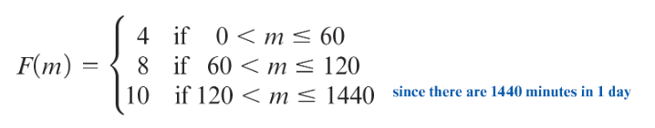

# Unit 4 - Piecewise Functions, Function Composition, and More Function Transformations

<!-- TOC -->
* [Unit 4 - Piecewise Functions, Function Composition, and More Function Transformations](#unit-4---piecewise-functions-function-composition-and-more-function-transformations)
* [General Notes](#general-notes)
* [Module 14 - Function Transformations Part 2](#module-14---function-transformations-part-2)
  * [Module 14 - Google Slides](#module-14---google-slides)
  * [Function Transformations](#function-transformations)
  * [Identify the Transformations](#identify-the-transformations)
    * [Identify Transformation One](#identify-transformation-one)
      * [Transformation One Image Format](#transformation-one-image-format)
    * [Identify Transformation Two](#identify-transformation-two)
      * [Transformation Two Image Format](#transformation-two-image-format)
    * [Identify Transformation Three](#identify-transformation-three)
      * [Transformation Three Image Format](#transformation-three-image-format)
  * [Identify Graph Transformations](#identify-graph-transformations)
    * [Identify Graph Transformation One](#identify-graph-transformation-one)
    * [Identify Graph Transformation Two](#identify-graph-transformation-two)
    * [Identify Graph Transformation Three](#identify-graph-transformation-three)
    * [Identify Graph Transformation Four](#identify-graph-transformation-four)
  * [Horizontal Reflections](#horizontal-reflections)
  * [Transformations Sheet](#transformations-sheet)
    * [Transformations Sheet One](#transformations-sheet-one)
    * [Transformations Sheet Two](#transformations-sheet-two)
* [Module 15 - Piecewise Functions](#module-15---piecewise-functions)
  * [Module 15 - Google Slides](#module-15---google-slides)
  * [Piecewise Function Definition](#piecewise-function-definition)
  * [Roadtrip Problem](#roadtrip-problem)
    * [Initial Story](#initial-story)
    * [Roadtrip Graph](#roadtrip-graph)
    * [Creating a Function for the Model](#creating-a-function-for-the-model)
      * [Creating Segments Per Portion of the Road Trip](#creating-segments-per-portion-of-the-road-trip)
      * [Final Piecewise Function](#final-piecewise-function)
  * [How to Create a Piecewise Function](#how-to-create-a-piecewise-function)
  * [Example Problems](#example-problems)
  * [Parking Garage Problem](#parking-garage-problem)
  * [Parking Garage Graph](#parking-garage-graph)
  * [Additional Piecewise Function Problems](#additional-piecewise-function-problems)
    * [Piecewise Function Problem One](#piecewise-function-problem-one)
    * [Piecewise Function Problem Two](#piecewise-function-problem-two)
      * [Problem Two Finished Piecewise Function](#problem-two-finished-piecewise-function)
    * [Piecewise Function Problem Three](#piecewise-function-problem-three)
      * [Problem Three Finished Piecewise Function](#problem-three-finished-piecewise-function)
    * [Piecewise Function Problem Four](#piecewise-function-problem-four)
      * [Problem Four Finished Piecewise Function](#problem-four-finished-piecewise-function)
      * [Problem Four Meaning](#problem-four-meaning)
      * [Problem Four Piecewise Graph](#problem-four-piecewise-graph)
    * [Piecewise Function Problem Five - Graphs](#piecewise-function-problem-five---graphs)
      * [Piecewise Graph One](#piecewise-graph-one)
        * [Piecewise Graph One Finished Function](#piecewise-graph-one-finished-function)
      * [Piecewise Graph Two](#piecewise-graph-two)
        * [Piecewise Graph Two Finished Function](#piecewise-graph-two-finished-function)
  * [Solving For Functions vs Graphs](#solving-for-functions-vs-graphs)
    * [How To Solve For Functions](#how-to-solve-for-functions)
    * [How To Solve For Graphs](#how-to-solve-for-graphs)
      * [Example Graph](#example-graph)
* [Module 16 - Function Composition](#module-16---function-composition)
* [Module 17 - Systems of Equations](#module-17---systems-of-equations)
<!-- TOC -->

# General Notes

# Module 14 - Function Transformations Part 2

## Module 14 - Google Slides

> **Links:**
> [Slides](https://docs.google.com/presentation/d/e/2PACX-1vSJZJ4MIfKp-NfjwdNaaEFt_IAtgMXfJ9rz80F9tNHVOFgl0yE26iduCQDu6cLBLs-eKNQ5UDnSt1Cl/embed?start=false&loop=false&delayms=3000)
> | [PDF](https://learn.maricopa.edu/courses/1265474/files/93475677/download)
>
> 

## Function Transformations

The function **_g_(x) = a&fnof;(x-c) + d** is a transformed function in terms of
the parent function **&fnof;(x)**.

The parameters **a**, **c**, and **d**
transform the function in the following ways:

| Parameter | Transformation                                                                                                                                                                                                                                                                                           |
|:---------:|:---------------------------------------------------------------------------------------------------------------------------------------------------------------------------------------------------------------------------------------------------------------------------------------------------------|
|   **d**   | **Causes a vertical shift.**<ul><li>If **d > 0**, then there is a shift up.</li><li>If **d < 0**, then there is a shift down.</li></ul>                                                                                                                                                                  |
|   **a**   | **Causes a vertical stretch or compression.**<ul><li>If                                                                  **&vert;&hairsp;a&hairsp;&vert;  > 1**, then there is a vertical stretch.</li><li>If **0 < &vert;&hairsp;a&hairsp;&vert; < 1**, then there is a vertical compression.</li></ul> |
|   **c**   | **Causes a horizontal shift**<ul><li>If **c > 0**, then the shift is to the right.</li><li>If **c < 0**, then the shift is to the left.</li></ul>                                                                                                                                                        | 

## Identify the Transformations

### Identify Transformation One

Given the parent function is **&fnof;(x)**, the transformations used to create
the transformed function **_g_(x)** are:

> **_g_(x) = -2&fnof;(x) + 3**

- Vertical reflection
- Vertical stretch by a factor of 2
- Vertical shift up 3 units

Suppose that **&fnof;(x) = 2&radic;x - 1**. The formula in terms of **_x_**
for each of the functions is:

1. **_g_(x) = -2&fnof;(x) + 3**
2. **_g_(x) = -2(2&radic;x - 1) + 3**
    - You could leave it like this, but it's better to follow the rest of the
      steps for readability.
3. **_g_(x) = -4&radic;x +2 + 3**
4. **_g_(x) = -4&radic;x + 5**

#### Transformation One Image Format

---

### Identify Transformation Two

Given the parent function is **&fnof;(x)**, the transformations used to create
the transformed function **_k_(x)** are:

> **_k_(x) = 0.5&fnof;(x - 4)**

- Vertical compression by a factor of 0.5
- Horizontal shift to the right 4 units

Suppose that **&fnof;(x) = 2&radic;x - 1**. The formula in terms of **_x_**
for each of the functions is:

1. **_k_(x) = 0.5&fnof;(x - 4)**
2. **_k_(x) = 0.5(2&radic;(x - 4) - 1)**
    - The equation becomes **x - 4** inside the radical, because the input for
      **&fnof;** is **x - 4**, not just **x**.
    - The radical sign goes above both the **x** and the **4**, hence the
      parentheses.
3. **_k_(x) = 1&radic;(x - 4) - 0.5**
4. **_k_(x) = &radic;(x - 4) - 0.5**

#### Transformation Two Image Format

---

### Identify Transformation Three

Given the parent function is **&fnof;(x)**, the transformations used to create
the transformed function **_j_(x)** are:

> **_j_(x) = -4&fnof;(-x) - 0.5**

- Vertical reflection
- Vertical stretch by a factor of 4
- Horizontal reflection
- Vertical shift down 0.5 units

Suppose that **&fnof;(x) = 2&radic;x - 1**. The formula in terms of **_x_**
for each of the functions is:

1. **_j_(x) = -4(&fnof;(-x) - 0.5)**
2. **_j_(x) = -4(2&radic;-x - 1) - 0.5**
3. **_j_(x) = -8&radic;-x + 4 - 0.5**
4. **_j_(x) = -8&radic;-x + 3.5**

#### Transformation Three Image Format

---

## Identify Graph Transformations

### Identify Graph Transformation One

Suppose we were given the graph of the parent function **&fnof;** and asked to
graph the transformed function:

> **g(x) = 2&fnof;(x — 1)**

<u>The graph:</u>

- The graph was shifted to the right 1 unit, and stretched vertically by a
  factor of 2.
    - The **x** inputs were shifted to the right 1 unit.
    - The **y** outputs were stretched vertically by a factor of 2.

---

### Identify Graph Transformation Two

Suppose we were given the graph of the parent function **_r_** (in red) and the
transformed function **_b_** (in blue) and asked to identify the
transformations:

<u>Based on the graph, the formula of **_b_** in terms of **_r_** is:</u>

> **_b_(x) = r(x + 3) + 1**

To identify the transformations:

- **Vertical stretch or compression**
    1. Look for a change in outputs from on set of coordinates to the next on
       both graphs. If the parent function increases by 1 unit on both the _x_
       and _y_ axes, but the transformed function increases by more than 1 unit,
       there is either a stretch or compression.
- **Horizontal shift**
    1. Look for how far the transformed function is shifted horizontally from
       the parent function.
- **Vertical shift**
    1. Look for how far the transformed function is shifted vertically from the
       parent function.
- **Vertical reflection**
    1. Look for a change in the vertical direction of the graph.
    2. If the parent function is going one way vertically and the transformed
       function is vertically going the opposite way, there is a vertical
       reflection.
- **Horizontal reflection**
    1. Look for a change in the horizontal direction of the graph.
    2. If the parent function is going one way horizontally and the transformed
       function is horizontally going the opposite way, there is a horizontal
       reflection.

---

### Identify Graph Transformation Three

Suppose we were given the graph of the parent function **_r_** (in red) and the
transformed function **_b_** (in blue) and asked to identify the
transformations:

<u>Based on the graph, the formula of **_b_** in terms of **_r_** is:</u>

> **_b_(x) = 3r(x + 4)**

To identify the transformations:

- **Vertical stretch**
    1. The parent function increases by 1 unit on both the _x_ and _y_ axes, but
       the transformed function increases by 3 units on the _y_-axis and 1 unit
       on the _x_-axis.
    2. The increase in the transformed function is **3** times more than the
       increase in the parent function.
    3. The parent function starts at **(0, 1)**, but if it were stretched by
       a factor of **3**, then the transformed function would start at **(0, 3)
       **.
        - You can make sure that the predicted stretch is correct by either
          drawing out the graph or by checking the other points and making sure
          that they all align with what the y-values should be. _Use a table if
          necessary_.
    4. It's being stretched by a factor of **3**.
    5. It's also helpful to draw out the stretched graph to make sure that it
       matches the transformed graph.
- **Horizontal shift**
    1. The transformed function is shifted to the left by **4** units.

### Identify Graph Transformation Four

Suppose we were given the graph of the parent function **_r_** (in red) and the
transformed function **_b_** (in blue) and asked to identify the
transformations:

<u>Based on the graph, the formula of **_b_** in terms of **_r_** is:</u>

> **_b_(x) = -2r(x) + 2**

To identify the transformations:

- **Vertical reflection**
    1. The parent function is going one way vertically and the transformed
       function is vertically going the opposite way, there is a vertical
       reflection.
- **Vertical stretch**
    1. The transformed function decreases at twice the amount of the parent
       function.
- **Vertical shift**
    1. The transformed function is shifted up by **2** units.

## Horizontal Reflections

Suppose that the transformed function **_g_(x)** is:

> **_g_(x) = &fnof;(-x)**

Now suppose that the parent function **&fnof;** is:

> **&fnof;(x) = 4x - 5**

<u>The Result:</u>

---

In general, think of horizontal reflections as follows:

## Transformations Sheet

### Transformations Sheet One

### Transformations Sheet Two

- _This sheet was created by Kacie Joyner_

# Module 15 - Piecewise Functions

## Module 15 - Google Slides

> **Links:**
> [Slides](https://docs.google.com/presentation/d/e/2PACX-1vQ30ZMJ_t2tI1vMVEIlLJXwVpWTT4Lve51RYv6913y1-4sDXNSFAgQC0a4rvxM_tF8g03rKXRd6FHqZ/embed?start=false&loop=false&delayms=3000)
> | [PDF](https://learn.maricopa.edu/courses/1265474/files/93475673/download)
>
> 

## Piecewise Function Definition

A **piecewise function** is a function that is defined in different ways for
different intervals.

## Roadtrip Problem

### Initial Story

> On a recent road trip I traveled through various road conditions
> and weather patterns and so my average speed varied greatly
> throughout the day.
>
> I started the day at my brother’s house in a rural area in northern
> Florida. Because he lives so far from the highway my average
> speed for the first 1.75 hours was only 38 mph. Once I hit the
> highway however I was able to drive faster and hence I averaged
> 76 mph for the next 2.8 hours. Unfortunately, as is often the case
> in Florida, a sudden torrential rainstorm came up and the
> visibility was so bad that for the next 30 minutes I only averaged
> 8 mph! Finally, the rain stopped, but by then I was so tired I
> needed to take a rest, so I pulled off at the next exit and found a
> McDonald’s to sit at and surf the internet for a little while.

### Roadtrip Graph

_This graph represents the roadtrip problem:_

### Creating a Function for the Model

There are two options:

1. Create a separate function model per portion of the road trip and restrict
   the domain and range for each function.
    - The problem with this is that there are multiple models for the same road
      trip.
2. Use a piecewise function to model the road trip.

<u>**Goal:**</u> Create a function **&fnof;** to represent the total distance
_(in miles)_ traveled on my road trip, **_D_**, with respect to the amount of
time _(in hours)_ since I left my brother’s house, **_t_**.

#### Creating Segments Per Portion of the Road Trip

We start by creating a function for each portion of the road trip:

1. **Segment 1:** Average speed of **38** mph for **1.75** hours
    1. **66.5** miles traveled in the first **1.75** hours.
        - _Gotten by multiplying **38** by **1.75**._
    2. Practical domain starts at **[0, 0]** and ends at **[1.75, 0]**.
    3. Practical range starts at **[0, 0]** and ends at **[0, 66.5]**.
    4. The function is **_D_ = &fnof;(_t_) = 38t; 0 &leq; _t_ &leq; 1.75**
       _&larr; Practical domain_
2. **Segment 2:** Average speed of **76** mph for **2.8** hours
    1. **212.8 miles** in the next **2.8** hours.
    2. Practical domain: **1.75 &leq; _t_ &leq; 4.55**
    3. Practical range: **66.5 &leq; _D_ &leq; 279.3**
    4. The function: **D = &fnof;(_t_) = 76(_t_ - 1.75) + 66.5**
        - Created using either the **CROC** or the transformation values.
3. **Segment 3:** Average speed of **8** mph for **0.5** hours
    1. **4** miles in the next **0.5** hours.
    2. Practical domain: **4.55 &leq; _t_ &leq; 5.05**
    3. Practical range: **279.3 &leq; _D_ &leq; 283.3**
    4. The function: **D = &fnof;(_t_) = 8(_t_ - 4.55) + 279.3**

The final segment functions for the road trip are:

> 1. **D = &fnof;(_t_) = 38t; 0 &leq; _t_ &leq; 1.75**
> 2. **D = &fnof;(_t_) = 76(_t_ - 1.75) + 66.5; 1.75 &leq; _t_ &leq; 4.55**
> 3. **D = &fnof;(_t_) = 8(_t_ - 4.55) + 279.3; 4.55 &leq; _t_ &leq; 5.05**

#### Final Piecewise Function

The final piecewise function is:

## How to Create a Piecewise Function

_Text Version:_

> A **piecewise function** is defined using two or more expressions over given
> intervals of the domain.
>
> The conditions define the input values for which each rule applies. The graphs
> of piecewise functions may be _continuous_ or _discontinuous_. Intuitively,
> a *
*discontinuous function** is one with a "break", "hole", or "jump" in its graph
> and a **continuous function** is one whose graph can be drawn without lifting
> one's pencil.

## Example Problems

1. **&fnof;(3) = 76(3 - 1.75) + 66.5** &rarr; **D = 161.5**
2. **57 = &fnof;(_t_)**
    1. Plug in the value for each rule until you find the correct rule.
    2. For rule 1, it results in **_t_** = **1.5**.
        - This meets the condition for rule 1, so it is the correct rule.
    3. For rule 2, it results in **_t_** = **1.625**.
    4. For rule 3, it does not produce a valid result either.

## Parking Garage Problem

Consider the given table, which shows the fees to park in the East Economy
Garage at Sky Harbor International Airport in Phoenix, Arizona for a single day.

We see that for any time over **0** minutes through **60 minutes**, the fee is
**$4.00**; for time over **60** through **120 minutes**, the fee is **$8.00**;
and for any time over **120 minutes** (for one day), the fee is **$10.00**.

<u>Table representing the parking garage problem:</u>

| Parking Time (minutes) _m_ | Parking Fee (dollars) _F_ |
|:-----------------------------------|:---------------------------------:|
| Over 0 through 60                  |             **4.00**              |
| Over 60 through 120                |             **8.00**              |
| Over 120                           |             **10.00**             |

First create functions for all three rules:

1. **F = &fnof;(_m_) = 4; 0 &leq; _m_ &leq; 60**
2. **F = &fnof;(_m_) = 8; 60 &leq; _m_ &leq; 120**
3. **F = &fnof;(_m_) = 10; 120 &leq; _m_**

Then create a piecewise function:

- <u>**Note: F(_m_) is a single function defined in many _pieces_, not many
  functions.**</u>

## Parking Garage Graph

Graphing the above piecewise function shows that **_F_(_m_)** is a discontinuous
combination of three linear functions.

- Use an open circle to denote that a value is not included in the function
- Use an arrow to denote that the function continues beyond the graph.

## Additional Piecewise Function Problems

### Piecewise Function Problem One

1. Evaluate **&fnof;(-5)**
    1. Use rule 1
    2. **&fnof;(-5) = 2(-5) + 4**
    3. **&fnof;(-5) = -10 + 4**
    4. **&fnof;(-5) = -6**
2. Evaluate **&fnof;(2)**
    1. Use rule 3
    2. **&fnof;(2) = 1.22**
    3. **&fnof;(2) = 1.44**
3. Evaluate **&fnof;(5)**
    1. Use rule 3
    2. **&fnof;(2) = 1.25**
    3. **&fnof;(2) = 2.48832**

### Piecewise Function Problem Two

> An Airbnb host charges **$125 a night** for the first **3 nights** you stay at
> their location. The charge then drops to **$110 a night** for each
> additional night up to **7 nights**. After that, the rate drops to
> **$95 a night**.
>
> The host does not allow anyone to stay longer than **3 weeks**. There is also
> a one-time service fee of **$50**.
>
> Define a piecewise function, **_a_** to represent the cost of a stay for
> **_n_** nights at this Airbnb.

1. <u>Function One</u>
    1. Add **50** to the end to account for the service fee
    2. **_a_(_n_) = 125(n) + 50; 1 &leq; _n_ &leq; 3**
2. <u>Function Two</u>
    1. Shift the function to the right by **3** to account for the first three
       nights
    2. Shift the function up by **125(3) + 50** to account for the price of
       the first three nights
        - Essentially plugging the max domain value of the previous function
          into the previous function as the
          input.
        - _Equals **425**_
    3. **_a_(_n_) = 110(_n_ - 3) + 425; 4 &leq; _n_ &leq; 7**
3. <u>Function Three</u>
    1. Shift the function to the right by **7** to account for the first seven
       nights
    2. Shift the function up by **110(7 - 3) + 425** to account for
       the price of the first seven nights
        - Essentially plugging the max domain value of the previous function
          into the previous function as the
        - _Equals **865**_
    3. The maximum for the domain is **21** nights
    4. **_a_(_n_) = 95(_n_ - 7) + 865; 8 &leq; _n_ &leq; 21**
4. Put the functions together

#### Problem Two Finished Piecewise Function

### Piecewise Function Problem Three

Federal income tax rates depend on the amount of taxable income received.
The following tax rate schedule shows the tax rates for unmarried (single)
filers for 2020 for the bottom 4 income levels.

NOTE: This means there is a tax rate of 10% on the first $9,875 of taxable
income, a rate of 12% on the taxable income between $9,876 and $40,125, a rate
of 22% on the taxable income between $40,126 and $85,525, etc

|  Rate   | Income Tax Bracket  |
|:-------:|:-------------------:|
| **10%** |    $0 to $9,875     |
| **12%** |  $9,876 to $40,125  |
| **22%** | $40,126 to $85,525  |
| **24%** | $85,526 to $163,300 |

1. <u>Function One</u>
    1. **_T_(_I_) = 0.10(_I_); 0 &leq; _I_ &leq; 9875**
2. <u>Function Two</u>
    1. Shift the function to the right by **9875** to account for the first
       income level.
    2. Plug in the max value of the domain into _function one_ to get the
       value to shift the function up by
        1. **_T_(_I_) = 0.10(9875)**
        2. **987.50**
    3. Final function: **_T_(_I_) = 0.12(_I_ - 9875) + 987.50; 9876 &leq; _I_
       &leq; 40125**
3. <u>Function Three</u>
    1. Shift the function to the right by **40125** to account for the second
       income level.
    2. Plug in the max value of the domain into _function two_ to get the
       value to shift the function up by
        1. **_T_(_I_) = 0.12(40125 - 9875) + 987.50**
        2. **4617.50**
    3. Final function: **_T_(_I_) = 0.22(_I_ - 40125) + 4,617.50; 40126
       &leq; _I_ &leq; 85525**
4. <u>Function Four</u>
    1. Shift the function to the right by **85525** to account for the third
       income level.
    2. Plug in the max value of the domain into _function three_ to get the
       value to shift the function up by
        1. **_T_(_I_) = 0.22(85525 - 40125) + 4617.50**
        2. **14605.5**
    3. Final function: **_T_(_I_) = 0.24(_I_ - 85525) + 14605.50; 85526
       &leq; _I_ &leq; 163300**

#### Problem Three Finished Piecewise Function

### Piecewise Function Problem Four

> A 2.4-mile swim, 112-mile bike ride, and a 26.2-mile run make up an Ironman
> Triathlon competition.
>
> A certain triathlete averages a swimming speed of 2.4 mph, a cycling speed of
> 18 mph, and a running speed of 10 mph.
>
> Assume there is no transitioning time from one segment of the race to another.

- _Source: <www.ironmanarizona.com>_
- Recall that **distance = rate * time**

<u>Goal:</u>

- Develop a piecewise function for the speed, **_S_**, of the participant as
  a function of his time, **_t_**, in hours.

To solve this, we need to understand the speed at any given time within the
race. So we will alter the **distance** formula to get the **time** required to
complete each portion of the race and put the results into a table to better
understand the problem:

| Segment | Distance (mi) | Rate (mph) | Time (hrs) |
|:-------:|:-----------------:|:--------------:|:--------------:|
|  Swim   |      2.4 mi       |      2.4       |       1        |
|  Bike   |      112 mi       |       18       |      6.22      |
|   Run   |      26.2 mi      |       10       |      2.62      |

- The **Time** section was found by using **time = distance
  &frasl;rate**

1. <u>Function One</u>
    1. **_S_(_t_) = 2.4; 0 &leq; _t_ &leq; 1**
2. <u>Function Two</u>
    1. **_S_(_t_) = 18; 1 < _t_ &leq; 7.22**
        - It is **7.22** instead of **6.22**, because you need to add the time
          it took to swim to the time it took to bike.
3. <u>Function Three</u>
    1. **_S_(_t_) = 10; 7.22 < _t_ &leq; 9.84**
        - It is **9.84** instead of **2.62**, because you need to add the time
          it took to swim and bike to the time it took to run.

#### Problem Four Finished Piecewise Function

#### Problem Four Meaning

Meaning behind each piece of the piecewise function:

1. **_S_(_t_) = 2.4; 0 &leq; _t_ &leq; 1**
    - While swimming the first hour, the participant had an average speed of 2.4
      mph.
2. **_S_(_t_) = 18; 1 < _t_ &leq; 7.22**
    - For the next 6.22 hours, the participant had an average speed of 18 mph
      while biking.
3. **_S_(_t_) = 10; 7.22 < _t_ &leq; 9.84**
    - For the last 2.62 hours, the participant had an average speed of 10 mph
      while running.

---

#### Problem Four Piecewise Graph

---

### Piecewise Function Problem Five - Graphs

#### Piecewise Graph One

Determining the piecewise function of the graph:

First we need to figure out the function that is being used per interval:

> Formula 1: **m = (y2 - y1) / (x2 - x1)**
> Formula 2:

1. <u>Function One</u>
    1. Find the slope
        1. **_Point 1:_ [-6, 4]** & **_Point 2:_ [-2, -2]**
        2. **-2 - 4&frasl;-2 - (-6)**
        3. **-6&frasl;-4**
        4. **1.5**
    2. Find the transformations (using only the relevant section)
        1. The graph is shifted to the left **6**
        2. The graph is shifted up **4**
    3. Find the domain: **-6 &leq; _x_ &leq; -2**
    4. Final function: **&fnof;(_x_) = 1.5(_x_ + 6) + 4; -6 &leq; _x_ &leq; -2**
2. <u>Function Two</u>
    1. The output is just **-2**
    2. Find the domain: **-2 &lt; _x_ &leq; 2**
    3. Final function: **&fnof;(_x_) = -2; -2 &lt; _x_ &leq; 2**
3. <u>Function Three</u>
    1. Find the slope
        1. **_Point 1:_ [3, -2]** & **_Point 2:_ [5, 4.5]**
        2. **4.5 - 3 &frasl; 5 - 3**
        3. **1.5 &frasl; 2**
        4. **0.75**
    2. Find the transformations (using only the relevant section)
        1. The graph is shifted to the right **3**
        2. The graph is shifted down **2**
    3. Find the domain: **3 &lt; _x_ &lt; 5**
    4. Final function: **&fnof;(_x_) = 0.75(_x_ - 3) - 2; 3 &lt; _x_ &lt; 5**

##### Piecewise Graph One Finished Function

#### Piecewise Graph Two

Determining the piecewise function of the graph:

1. <u>Function One</u>
    1. Find the slope
        1. **_Point 1:_ [-5, -8]** & **_Point 2:_ [-2, -2]**
        2. **-2 - (-8) &frasl; -2 - (-5)**
        3. **6 &frasl; 3**
        4. **2**
    2. Find the transformations (using only the relevant section)
        1. The graph is shifted to the left **5**
        2. The graph is shifted down **8**
    3. Find the domain: **-5 &lt; x &leq; -2**
    4. Final function: **&fnof;(_x_) = 2(_x_ + 5) - 8; -5 &lt; x &leq; -2**
2. <u>Function Two</u>
    1. Find the slope
        1. **_Point 1:_ [-2, 1] & _Point 2:_ [2, -1]**
        2. **-1 - 1 &frasl; 2 - (-2)**
        3. **-2 &frasl; 4**
        4. **-0.5**
    2. Find the transformations (using only the relevant section)
        1. The graph is shifted to the left **2**
        2. The graph is shifted up **1**
    3. Find the domain: **-2 &lt; _x_ &leq; 2**
    4. Final function: **&fnof;(_x_) = -0.5(_x_ + 2) + 1; -2 &lt; _x_ &leq; 2**
3. <u>Function Three</u>
    1. Find the slope
        1. **_Point 1:_ [2, -1]** & **_Point 2:_ [6, -7]**
        2. **-7 - (-1) &frasl; 6 - 2**
        3. **-6 &frasl; 4**
        4. **-1.5**
    2. Find the transformations (using only the relevant section)
        1. The graph is shifted to the right **2**
        2. The graph is shifted down **1**
    3. Find the domain: **2 &lt; _x_ &le; 6**
    4. Final function: **&fnof;(_x_) = -1.5(_x_ - 2) - 1; 2 &lt; _x_ &le; 6**

##### Piecewise Graph Two Finished Function

## Solving For Functions vs Graphs

### How To Solve For Functions

1. Determine the domain
   - The maximum domain for the current function will serve as both the 
     horizontal shift and the minimum domain for the next function.
     - **Example:** If the domain is **-2 &le; _x_ &le; 2**, then the 
       horizontal shift for the next function is **2 to the left** and the minimum domain for the next function is **-2**.
   - This can usually be found with common sense or within the problem. Remember that it should pick up where the maximum domain of the previous function left off.
2. Determine the range
   - The maximum range for the current function will serve as both the 
     vertical shift and the minimum range for the next function.
     - **Example:** If the range is **-2 &le; _y_ &le; 2**, then the 
       vertical shift for the next function is **2 up** and the minimum range for the next function is **2**.
   - The range can be determined by plugging in the domain values individually into the function.
     - If you already have the minimum range from the previous function, then you only need to plug in the maximum value for the next function's minimum.
3. Determine the slope
   - You can use the slope formula to find the slope between two points:
     **y2 - y1 &frasl; x2 - x1**
4. Determine the transformations
   - The horizontal shift is the minimum domain of the current function.
   - The vertical shift is the minimum range of the current function.
5. Determine the final piece of the piecewise function by separating the function and domain by a semicolon.
   - **Example:** **&fnof;(_x_) = 2(_x_ - 2) + 2; -2 &lt; _x_ &le; 2**
6. Repeat steps **1-5** until you have found the function for the entire graph.
7. Create the final piecewise function:
   - 

### How To Solve For Graphs

1. Determine the domain
   - You can find this by identifying the beginning and end of where the slope changes on the graph.
     - _I.e., The graph is going in a straight line, stops, and then goes in a different direction._
   - Make sure to check whether the point is inclusive or exclusive. You will usually write each functions minimum to be exclusive besides the very first one.
     - **Example:** **-2 &lt; _x_ &le; 2**
2. Determine the range
   - You can find this by identifying the beginning and end of where the slope changes on the graph.
     - _I.e., The graph is going in a straight line, stops, and then goes in a different direction._
3. Determine the slope
   - You can use the slope formula to find the slope between two points:
     **y2 - y1 &frasl; x2 - x1**
4. Determine the transformations
   - The horizontal shift is the minimum domain of the current function.
   - The vertical shift is the minimum range of the current function.
   - <u>_Note:</u> You can also visually look at the graph to determine the transformations. You will look at how horizontally and vertically shifted the beginning point of the line is._
5. Determine the final piece of the piecewise function by separating the function and domain by a semicolon.
   - **Example:** **&fnof;(_x_) = 2(_x_ - 2) + 2; -2 &lt; _x_ &le; 2**
6. Repeat steps **1-5** until you have found the function for the entire graph.
7. Create the final piecewise function:
   - 

**Note:** You can create a piecewise function in Desmos by putting the rules/conditions after the function in bracketed parentheses and separating them with commas:

> **&fnof;(_x_) = 76(x - 1.75) + 66.5 {1.75 < x &le; 4.55}**

#### Example Graph

- **Graph Link:** <https://www.desmos.com/calculator/jpyxmxnp48>

# Module 16 - Function Composition

# Module 17 - Systems of Equations