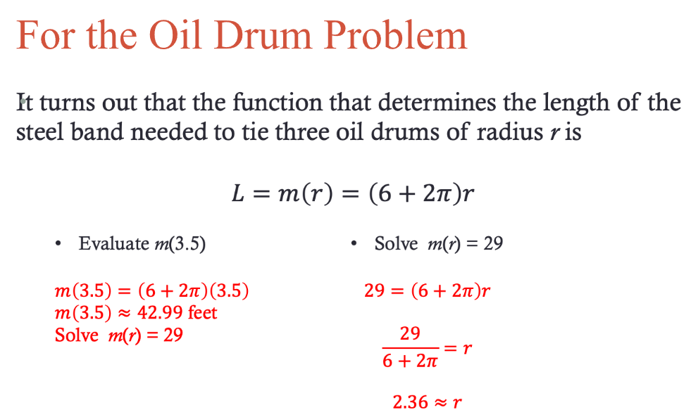
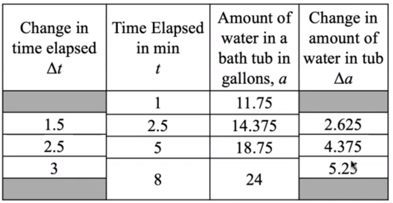

# Unit 1 Notes

# Module 2

The Google Slides can be found [Here](https://docs.google.com/presentation/d/e/2PACX-1vRfTdak79YenGY3YC0UNRa1j6N7MTNX8HQNgC1czcfaWhCsbMbWEV6WXKL8-J_NDZPgU4nZeauusE1t/embed?start=false&loop=false&delayms=3000&slide=id.p1)

## General Notes

- **Quantity:** A characteristic or attribute of some object you can imagine
  measuring.
  - When defining or identifying a quantity, we must be specific about what 
    object, and what specific characteristic about that object, we're referring 
    to.
- **Variable:** A character or symbol used to represent a quantity.
- **Evaluate:** To find the output of a function corresponding to a given input.
- **Solving:** To find the input of a function corresponding to a given output
- **Domain:** the set of all reasonable inputs values of a function.
- **Range:** The set of all corresponding output values of a function
- **Interval Notation:** [0, 100]
- **Inequality:** 0 <= x <= 100

## Functions

### Function Language

We say "_output_ as a function of _input_" or "_output_ in terms of _input_"
- y as a function of x **or** y in terms of x
- _E.g. Length of the steel band with respect to the radius of the oil drums_

If an input points to more than one output, then it is **not** a function.

### Example 1

### Example 2

### Example 3 - Oil Drum Problem

- `L` is the output
- `r` is the input

## Inverse Functions

An inverse function is a function that undoes the operations of an original 
function.

- This function inverses the oil drum problem's function.
- The `m` is the inverse, not a negative exponent
- This image shows that `L` is a function of `r` (the name of the function is
  `m`) and that `r` is a function of `L` (specifically, the function is the
  inverse of function `m` and is written **m-1**).
- **y = f(x) means that x = f-1(y) if the inverse of f is a function.**
- The inverse of a function is not always a function.
  - _A function has one input and one output_

- `F` is the output
- `c` is the input

- Always write the notation indicating that the input and outputs have switched.

### Finding The Inverse

1. Write the formula without the notation:
   1. **c = j(b) = 5b + 12**
   2. **c = 5b + 12**
2. Isolate the input until it's by itself

### Inverse of a Graph Example
<

## Writing Out Functions

## Domain and Range

- **Domain:** the set of all reasonable inputs values of a function.
- **Range:** The set of all corresponding output values of a function

### Example 1

### Example 2

### Example 3

## Intercepts

### Vertical Intercepts

The **Vertical Intercept** of a function is the coordinate point where the graph
of the function crosses the vertical axis.

- This point will always be in the form **(0, b)**
- The vertical intercept can be found graphically by determining the point where
  teh graph crosses the vertical axis.
- The vertical intercept can be found in a table or algebraically by first 
  determining the value of **b**. 
  - To do this, find the output of the function for an input of 0 
    _(or **f(0) = b**)_. You then write the intercept in the form **(0, b)**.

### Horizontal Intercepts

The **Horizontal Intercept** of a function is the coordinate point where the 
graph of the function crosses the horizontal axis.

- The point will always be in the form **(a, 0)**.
- The horizontal intercept can be found graphically by determining the point 
  where the graph crosses the horizontal axis.
- The horizontal intercept can be found in a table or algebraically by first
  determining the value of **a**. 
  - To do this, find the input of the function for an output of 0 
    _(or solve for **a** when **f(a) = 0**)_. You then write the intercept in
    the form **(a, 0)**.

## Constant Rate of Change

It is said that two quantities are related by a **constant rate of change (CROC)**
if the _ratio of the changes in quantities_ is <u>always</u> the same.

- Find the changes between each value in a table for all relevant columns, and
  use those in this formula.

### Example 1

- The triangle just means change

To figure out if the ratio is the same, the changes should all equal the same
number when put into the formula:

- Because all the numbers equal the same, it is **constant**.

This would be written as: **_For every additional minute_ that the water is left
running, the _amount of water_ in the bathtub _increases_ by 1.75 gallons.**

---

# Module 3

The Google Slides can be found [Here](https://docs.google.com/presentation/d/e/2PACX-1vRQZlIZ2sA2AG4r3AcRtlHJL4G_KHOqBBWZXkOfJbGEOpCWHhsg9yBZfZfAfkv_lmKRIGB0kkMrIS48/embed?start=false&loop=false&delayms=3000)

## General Notes

## Constant Rate of Change (Continued)

The <u>value</u> of the constant rate of change can always be determined by:

Knowing this info, you can also get the other values.

### Change in Output Value

### Change in Input Value

---

Instead of always using the formula to find the change in input / output or the
CROC, you can use repeated reasoning.

Imagine you have a pool with a hose in it filling it with water (it already has 
some in it). The CROC is **18.2**, and after **63 minutes**, there's 
**1382.6 gallons** inside. Instead of using formulas to find each value per 
different minute, you could create a formula:

1. Find **t** _(change in input value)_
   - **t - 63 = t**
2. Find **v** _(change in output value)_
   1. **18.2(t) = v**
   2. **18.2(t - 63) = v**
3. Find **_v_** _(total volume)_
   1. **v + 1382.6 = _v_**
   2. **18.2(t - 63) + 1382.6 = _v_**

- **** means **Increment / Change**

The last one is the finished formula for a function that defines a relationship
between the volume of water in the pool and the amount of time the pool has been
filling. It can also be summarized as:

### Change In Output

> **v = CROC(t - reference input) + reference Output**\
> **v = CROC(t - tref) + vref**

## General Form of a Linear Function

Whenever two quantities are related by a CROC, it's a line on a graph.

- That's where the **Linear Function** comes from
- The process above can be used any time there's a CROC and a known reference
  point.